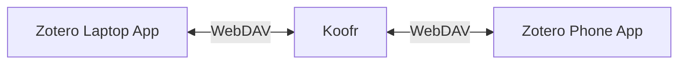

# Tools

Currently the setup I have looks like this:

So instead of using Zotero Sync, I use WebDAV which links to Koofr which provides 10GB for free.

That way Zotero handles a lot less data (just metadata). To save papers I use "Zotero Connector" add-on / browser extension.

I use "AI", "AI4Chem", "Reading", and "Other" collections (the Zotero "folders"), when a paper is being read it belongs to 1 or more collections, then is removed from "Reading".

I also add the tag "done" once I read it so it's easy to search.

JabRef seems to be usable alongside Zotero, but have not yet learnt it.
