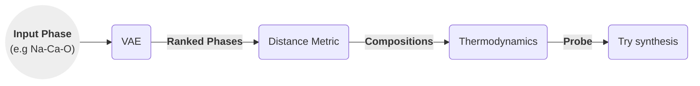

# Discovering Inorganic Solids

These are some of my opinions and ideas after reading two papers by Rosseinsky group:

1. [Discovery of Crystalline Inorganic Solids in the Digital Age][Account] (2025).
2. [Element selection for crystalline inorganic solid discovery guided by unsupervised machine learning of experimentally explored chemistry][Nature] (2021)

-----------

## Introduction

In solid-state chemistry, some elemental compositions (phase fields) are more likely to lead to isolable compounds than others.

Deep learning models can help differentiate between these two groups, and lead researchers to the promising areas. The models can be trained for this task with data from ICSD, the Inorganic Crystal Structure Database.

Such models would improve the allocation of resources when exploring new phase fields.

## Searching for new compounds

We can search for compounds by _analogy_ and by _exploration_, characterised in the table below:

| Method         | Starting Point               | Concept                                   | Success Rate |
|----------------|------------------------------|-------------------------------------------|--------------|
| By analogy     | Parent Compound              | Change composition, same structure        | Higher       |
| By exploration | Structural Hypothesis / Idea | Try composition and structure             | Lower        |

### Definitions

- _Phase field_: the elements selected. Can be thought as the labels for cartesian axes.
- _Composition_: the values or ranges of values in each axes.
    - Once we have the axes' labels we can explore values computationally.

### Analogy Based Search

The analogy-based search involves:

1. Starts from a naturally occuring mineral, or previously discovered structures,
2. Change its composition retaining the crystalline structure.
   - For example, $\mathrm{Li_7Si_2S_7I}$ can be expanded by analogy to $\mathrm{Li_7Si_{2-x}Ge_xS_7I}$, conserving the crystalline structure.

With respect to analogy-based search, the paper notes:

> (...) it is straightforward to expand known structures by analogy through substitution, but the initial identification of such structures, which cannot be by analogy, is an entirely different question (...)

And usefully,

> The properties of the analogy-based materials can be superior to those of the initial discovery (...)

### Exploratory Search

The ML-aided exploratory-search involves:

1. Human selects elements or _phase field_ e.g. $\mathrm{Y−Sr−Ca−Ga−O}$, $\mathrm{LiSiXX'}$,...
   - A VAE decodes the seed-input into similar compounds (nearby in latent space).
   - The reconstruction loss is used as a ranking metric for the generated compounds.
2. Computationally search in composition-space (Crystal Structure Prediction, CSP), find low-energy probe structures, e.g. $\mathrm{Y_8Sr_{32}Ca{_40}Ga_{80}O_{204}}$
   - Can use physical constraints (like max n of atoms).
   - Calculate thermodynamically stable[^1] probe structure (this step is complex).
      Hints experimentalists of promising region.
3. Try synthesis, and find somewhat similar structures to the computationally suggested one.

### Flowchart

We can describe the steps as a flow as well:

## Variational Autoencoder (VAE)

### Data Slice

4-element crystals are selected from ICSD, and only the elements are retained.
For example, $\mathrm{CaNaLiO_2}$ would become $\mathrm{CaNaLiO}$ for training.

The data is scaled 24 fold by performing all possible permutations of 4 elements (4\*3\*2\*1). This enhances learning, reduces overfitting.

### Input representation

A 37-dim descriptor (vector) is chosen for each atom; it is combined into a single 148 vector representing the 4 elements.

The descriptors are taken from a atom-property database and include atomic weight, valence, ionic radius, and others.

### Variational Autoencoder (VAE) Model

The model emphasis is on exploiting a pattern and not on interpretability, the human expert evaluates the compounds afterwards.

An autoencoder consists of two parts, an encoder, and a decoder. The overall task is to reconstruct the original vector from the compressed representation.

The encoder compresses the 148 vector into a 4D vector (latent vector), and the decoder decompresses it into 148D. The euclidean distance is then computed as a measure of error, and the gradient is used to correct the weights.

Since the model is trained only on phase fields that lead to isolable materials, it is biased towards those compounds.

Just like a single-class classifier using cat-only images, the VAE only sees positive instances, and no learning comes from predicting negatives.

### Inference Stage

Input structures are passed with a bit of noise each time and the reconstruction loss is used to rank them for synthetic exploration.

A larger reconstruction loss means the phase is less likely to be synthesizable, since it learn to reconstruct only synthesizable regions.

The rank will also tell how different the compound is to the original.

### Example of Results

After VAE ranking, the decision to explore Li-Sn-S-Cl phase field was based on the high conductivity of a related ternary field Li-Sn-S.

The following image shows calculations performed, each a tripod, in a red background. Dark red represents little enery barrier from the convex hull, bright red the opposite.

Most solids found by the group or by others are in dark areas of the plot with tripods overlaying.

The magenta point A in the image is the new phase found, not far from the probe structure which was $\mathrm{Li_3SnS_3Cl}$.

 <!--other classes: w220, w420-->
    
    

    Image from <a href="https://www.nature.com/articles/s41467-021-25343-7">Original Paper</a> under <a href="https://creativecommons.org/licenses/by/4.0/">CC-BY-SA 4.0</a>
    

[Account]: https://pubs.acs.org/doi/10.1021/acs.accounts.4c00694
[Nature]: https://www.nature.com/articles/s41467-021-25343-7
[^1]: With respect to the convex hull.
