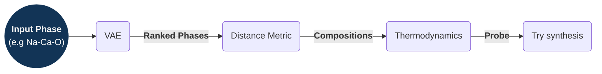

# Discovering Inorganic Solids

These are some of my opinions and ideas after reading two papers by Rosseinsky group:

1. [Discovery of Crystalline Inorganic Solids in the Digital Age][Account] (2025).
2. [Element selection for crystalline inorganic solid discovery guided by unsupervised machine learning of experimentally explored chemistry][Nature] (2021)

-----------

## Introduction

In solid-state chemistry, some elemental compositions (phase fields) are more likely to lead to isolable compounds than others.

Deep learning models can help differentiate between these two groups, and lead researchers to the promising areas. The models can be trained for this task with data from ICSD, the Inorganic Crystal Structure Database.

Such models would improve the allocation of resources when exploring new phase fields.

## Searching for new compounds

Some definitions will be used:

- _Phase field_: the elements selected. Can be thought as the labels for cartesian axes.
- _Composition_: the values or ranges of values in each axes. Once we have the axes' labels we can explore values computationally.

We can search for compounds by _analogy_ and by _exploration_, characterised in the table below:

| Method         | Starting Point               | Concept                                   | Success Rate |
|----------------|------------------------------|-------------------------------------------|--------------|
| By analogy     | Parent Compound              | Change composition, same structure        | Higher       |
| By exploration | Structural Hypothesis / Idea | Try composition and structure             | Lower        |

### Analogy Based Search

The analogy-based search involves:

1. Starts from a naturally occuring mineral, or previously discovered structures,
2. Change its composition retaining the crystalline structure. For example, $\mathrm{Li_7Si_2S_7I}$ can be expanded by analogy to $\mathrm{Li_7Si_{2-x}Ge_xS_7I}$, conserving the crystalline structure.

With respect to analogy-based search, the paper notes:

> (...) it is straightforward to expand known structures by analogy through substitution, but the initial identification of such structures, which cannot be by analogy, is an entirely different question (...)

And usefully,

> The properties of the analogy-based materials can be superior to those of the initial discovery (...)

### Exploratory Search

The ML-aided exploratory-search involves:

1. Human selects elements or _phase field_ e.g. $\mathrm{Y−Sr−Ca−Ga−O}$, $\mathrm{LiSiXX'}$,...
   - A VAE decodes the seed-input into similar compounds (nearby in latent space).
   - The reconstruction loss is used as a ranking metric for the generated compounds.
2. Computationally search in composition-space (Crystal Structure Prediction, CSP), find low-energy probe structures, e.g. $\mathrm{Li_3SnS_3Cl}$.
   - Can use physical constraints (like max n of atoms).
   - Calculate thermodynamically stable[^1] probe structure (this step is complex).
      Hints experimentalists of promising region.
3. Try synthesis, and find somewhat similar structures to the computationally suggested one.

We can describe the exploration steps as a flow as well:

[Account]: https://pubs.acs.org/doi/10.1021/acs.accounts.4c00694
[Nature]: https://www.nature.com/articles/s41467-021-25343-7
[^1]: With respect to the convex hull.
