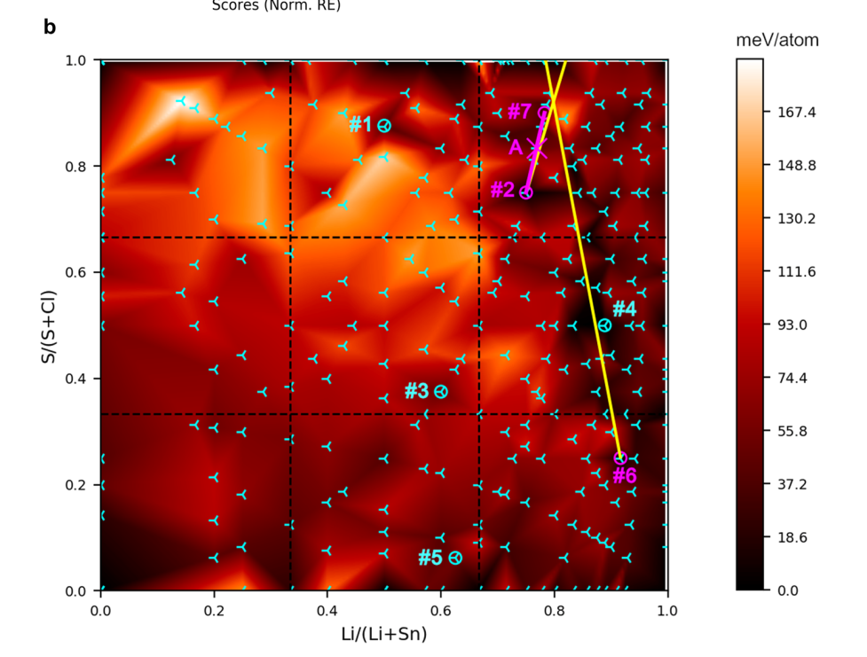

# Discovering Inorganic Solids

## In depth workflow

### Dataset

The atom descriptors are taken from a atom-property database and include atomic weight, valence, ionic radius, and others.

The 4-element crystals are selected from ICSD, and only the elements are retained.
For example, $\mathrm{CaNaLiO_2}$ would become $\mathrm{CaNaLiO}$ for training.

The data is scaled 24 fold by performing all possible permutations of 4 elements, i.e. 4! (factorial). This enhances learning, reduces overfitting.

### Architecture: Variational Autoencoder (VAE)

Here the emphasis is on exploiting a pattern and not on interpretability, the human expert evaluates the compounds afterwards.

An autoencoder consists of two parts, an encoder, and a decoder. The overall task is to reconstruct the original vector from the compressed representation.

The encoder compresses the 148 vector into a 4D vector (latent vector), and the decoder decompresses it into 148D. The euclidean distance is then computed as a measure of error, and the gradient is used to correct the weights.

Since the model is trained only on phase fields that lead to isolable materials, it is biased towards those compounds.

Just like a single-class classifier using cat-only images, the VAE only sees positive instances, and no learning comes from predicting negatives.

### Inference Stage

Input structures are passed with a bit of noise each time and the reconstruction loss is used to rank them for synthetic exploration.

A larger reconstruction loss means the phase is less likely to be synthesizable, since it learn to reconstruct only synthesizable regions.

The rank will also tell how different the compound is to the original.

## Example of Results

After VAE ranking, the decision to explore Li-Sn-S-Cl phase field was based on the high conductivity of a related ternary field Li-Sn-S.

The following image shows calculations performed, each a tripod, in a red background. Dark red represents little enery barrier from the convex hull, bright red the opposite.

Most solids found by the group or by others are in dark areas of the plot with tripods overlaying.

The magenta point A in the image is the new phase found, not far from the probe structure which was $\mathrm{Li_3SnS_3Cl}$.

 <!--other classes: w220, w420-->
    
    

    Image from <a href="https://www.nature.com/articles/s41467-021-25343-7">Original Paper</a> under <a href="https://creativecommons.org/licenses/by/4.0/">CC-BY-SA 4.0</a>
    

[Account]: https://pubs.acs.org/doi/10.1021/acs.accounts.4c00694
[Nature]: https://www.nature.com/articles/s41467-021-25343-7
[^1]: With respect to the convex hull.
