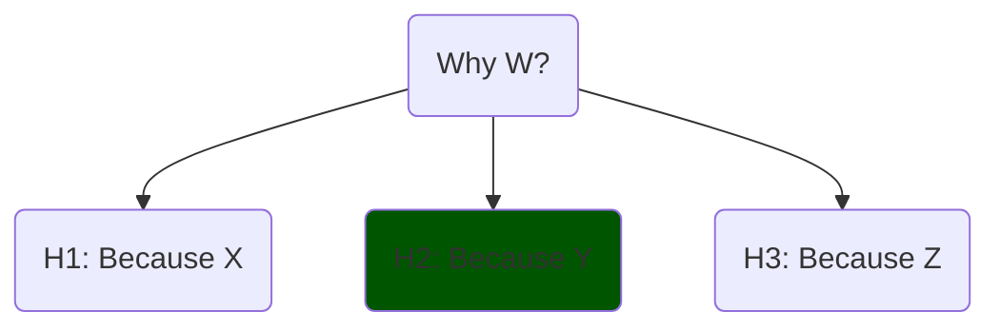

# What is an explanation?

Let's start with an example. Concepts are expanded in the remaining sections.

## Example

You open a drawer, and a conversation with a friend starts.

> Friend: Why did the drawer slide out?\
> You: Because I pulled it out? Had I not, the drawer wouldn't have slide.

The answer is an _efficient_ cause. Aristotle proposed 4 causes: _efficient_ (mechanism), _formal_ (form, shape), _material_ (properties), _final_ (purposes).

Hume instead, understood causes through _counterfactuals_. The answer is also a _counterfactual_: the hypothesis that _without_ the event X, there wouldn't be the consequence Y. In other words, X is necessary for Y to happen (its cause).

> Friend: I _know_ that. But why does it slide _rather than_ opening like a lid?\
> You: Oh! I see. The drawer sits on rails allowing it to slide.\

The _rather than ..._ is a contrast called _foil_. If the foil is absent, we may guess it, or ask for further clarifications. _Foils_ make answering easier.

The friend may keep asking "Why" and eventually reject or accept the causal chain (or remain sceptical).

Notice the **social process** involved: we tried to guess the friend's actual _knowledge gap_ (first wrongly, he _knew_ that), and to emit relevant information. There are also other aspects that matter, such as testing the claim, finding a useful contrast, and so forth.

## Definition of Explanation

We can start with an oversimplified definition, an _explanation_ is:

> An answer to a why-question referring to the cause of an event, or see it as an instance of a general pattern. It is also expected that it does not contradict prior beliefs or knowledge.

Although not only _why-questions_ prompt explanations. Inferential reasoning (next section) plays an interesting role. Also class-membership can help explain events: "Light interferes because it is a wave.".

In section **2.1.2**, [Explanation in artificial intelligence: insights from the social sciences][explanations_social] characterises an explanation as:

A **cognitive process**, which involves finding and assigning the cause of an event, known as _causal attribution_. A **product**, resulting from the cognitive process. A **social process**, which involves communicating the product.

Another interesting aspect is the identification of what is explanatory relevant, and what is not. Consider two light beams interfering on a Sunday. The day _should_ be of little relevance (not always). We are disregarding a confounding factor.

Beliefs, prior knowledge and assumptions play an important role in the generation of hypotheses. In a sense, the hypothesis generated (cause-candidate) is conditioned on knowledge. Here is a cute example from [The structure and function of explanations][lombrozo]:

> explanations [hypotheses] can lead reasoners to override the influence of similarity. If told that herring and tuna have a disease, naive participants are more likely to extend the property to wolffish, the more similar item, than to dolphins. However, among fishing experts, who can generate an explanation for why the property might hold (e.g. tuna contract the disease by eating infected herring), similarity is less predictive of property extensions.

Let's now expand on the _cognitive_ and _social_ processes of an explanation.

## Cognitive process

We now discuss _causes_, _causal attribution_ and _abductive reasoning_ in the context of the cognitive process.

### Causes

We already mentioned Aristotle's 4 kinds of _causes_ that pick on different aspects to answer a _why-question_. These explanations are not always exclusive, they can be complementary.

We also causes derived from _counterfactuals_: A is the cause of B if, had A not happened, B wouldn't have happened. This view was formalised by Pearl and Halpern.

_Are all Aristotelian causes Humean causes?_ The one that best fits the definition is the _efficient_ cause; the rest are not naturally understood as events so they don't easily fit as counterfactuals.

In science, _effective causes_ and _counterfactuals_ are most common. But in everyday life, all Aristotelian causes are used.

In addition, [Explanation in AI: insights from the social sciences][explanations_social] notes that _why-questions_ are usually contrastive questions, phrased as _why P rather than Q_ instead of _why P_. In this latter case, the _foil_ (Q) is implicit.

### Inference

Inference can play an important role in explanations:
- Deductive: Light is a wave; all waves interfere; then light beams interfere,
- Inductive (generalisation): Bats are mammals; bats fly; maybe all mammals fly,
- **Abductive**: Light shows interference patterns, waves interfere, maybe light is a wave. It proposes a hypothesis to explain a fact.

Causal attribution is closely related to **abductive inference**. Abduction is 3-step process, not too different from the scientific process itself:

1. Propose hypothetical causes (or chains of causes, meaning a series of causally connected events), this is a creative process
2. Select the best given the available evidence; this filtering process is dependent upon prior knowledge,
3. Maintain until contradicted by experience or super-seeded (e.g. by a simpler explanation).

The way we generate hypothesis is very complex. It may involve creativity, metaphors, analogies; we won't go further into this aspect.

### Strength of a Hypothesis
The plausibility of a hypothesis or causal claim is affected by different aspects, such as:

- Its _simplicity_: if it involves a shorter chain of causes, it is preferred,
- Its _generality_: if it explains other cases, it is preferred,
- The role of _prior knowledge_ (or beliefs) generating and filtering hypotheses is quite important. An answer like "The drawer slides because it has a motor", may be ignored in different basis.

<!-- Most inferences can be explanations: deductive (derivation from true propositions), abductive (a selected hypothesis, which may engulf _deduction_), inductive (sample$\rightarrow$population); also general category, which is similar to induction, such as "it is a kind of mammal hence ...". -->

I don't have much to say about _product_ (`2.`), so we jump to `3`.

## Social Process

The causal-hypothesis must then be communicated, and there are expectations about it.

[Gricean Maxims][gricean_maxims] are rules observed in _good_ communication. We can use these rules as a guide for good _model explanations_ as well.

1. **Informative** (Quantity): right amount of context and details,
2. **Truthful** (Quality, or Fidelity): Try to make it true,
3. **Relevance** (Relation): do not state things that aren't needed (provide insight),
4. **Manner** (clarity): express it in elegant terms.

## Metaphors

The Machine and The Agent (click to open)

In the scientific and science-adjacent domains, models are conceptualised as _machines_:

1. They have parts, each with a function, a role,
2. They correspond with some aspect of the reality being modelled.

Outside of science or the technical domain, they're conceptualised as _human-like agents_:

1. They tend to be explained in human terms,
2. They are expected to be reliable, consistent, ...

So explanations are answers to _why-questions_; _good_ explanations respect the Gricean maxims, and will be dependent on the audience (their preferred style, expectations, expertise).

We could also select more metaphors and more audiences, or make divisions within each; the table below summarises key aspects.

| Perspective      | Model is a… | Preferred Explanation style           | Audience            |
| ---------------- | ----------- | --------------------------- | ------------------- |
| **Scientific**   | Machine     | Mechanistic, causal, formal | Experts             |
| **Human-facing** | Agent       | Intentional, narrative      | Users, stakeholders |

In the next post we use our knowledge to define Explainable AI.

------------

List of sources used in this blogpost

1. [On the mechanization of abductive logic][abductive_logic] (1973). The first page is quite interesting.
<!-- A **deduction** (proof) is e.g. "All cats are animals (I); animals are big (II); then cats are big (III)", whereas **abduction** (hypothesis) would be "III; I; maybe II" notice the _maybe_ (anti-clockwise rotation). Another anti-clockwise rotation takes us to **induction** (generalisation,hypothesis): "II; III; maybe all I". -->
1. [A Unified Approach to Interpreting Model Predictions][shap_values] (2017): paper proposing SHAP, that is, showing Shapley values as the best coefficients in linear combination of features, given 3 requirements (local accuracy, missingness and consistency),
1. [Explaining Explanations: An Overview of Interpretability of Machine Learning][xx] (2018),
1. [Producing radiologist-quality reports for interpretable artificial intelligence][xai_rnn_radiology] (2018): a "case study",
1. The paper ["Explanation in artificial intelligence: insights from the social sciences"][explanations_social] (2019, 38 pages). Once the why-cause is found (diagnosis), it may be communicated, making rules of conversation relevant: [Gricean Maxims of Communication][gricean_maxims] (blog-post), or [Wikipedia's][wikipedia_gricean].
   - The definition of explanation extends previous work by Lombrozo on [The structure and function of explanations][lombrozo] (2006).
1. [The perils and pitfalls of explainable AI: Strategies for explaining algorithmic decision-making][perils_and_pitfalls] (2021): emphasis on socio-political aspects,
1. [Interpretable and Explainable Machine Learning for Materials Science and Chemistry][xai4mat] (2022),
1. Blog Posts: [What is Explainable AI?][what_is_xai] (2022) and from [IBM][xai_ibm],
1. [A Perspective on Explainable Artificial Intelligence Methods: SHAP and LIME][using_shap_lime] (2024).

<!-- Also, a very interesting experiment in terms of explainability was <https://distill.pub>. -->

[xai4mat]: https://pubs.acs.org/doi/10.1021/accountsmr.1c00244
[using_shap_lime]: https://onlinelibrary.wiley.com/doi/abs/10.1002/aisy.202400304
[xx]: http://arxiv.org/abs/1806.00069
[shap_values]: https://proceedings.neurips.cc/paper/2017/hash/8a20a8621978632d76c43dfd28b67767-Abstract.html
<!-- [XAI for whom]: http://arxiv.org/abs/2106.05568 -->
[what_is_xai]: https://www.sei.cmu.edu/blog/what-is-explainable-ai/
[xai_ibm]: https://www.sei.cmu.edu/blog/what-is-explainable-ai/
[xai_rnn_radiology]: https://arxiv.org/abs/1806.00340
[perils_and_pitfalls]: https://www.sciencedirect.com/science/article/pii/S0740624X21001027
[abductive_logic]:https://www.ijcai.org/Proceedings/73/Papers/017.pdf
[explanations_social]: https://www.sciencedirect.com/science/article/pii/S0004370218305988
[gricean_maxims]: https://effectiviology.com/principles-of-effective-communication/
[wikipedia_gricean]: https://en.wikipedia.org/wiki/Cooperative_principle
[lombrozo]: https://fitelson.org/few/few_08/lombrozo_reading.pdf
