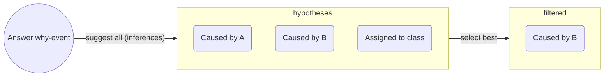

<!-- Should analyse at least 10 kinds of explanations -->

# What is an explanation?

Let's start with an example. Concepts are expanded in the remaining sections.

## An explanation example

You open a drawer, and a conversation with a friend starts.

> Friend: Why did the drawer slide out?\
> You: Because I pulled it out? Had I not, the drawer wouldn't have slide.

The answer is an _efficient_ cause. Aristotle proposed 4 causes: _efficient_ (mechanism), _formal_ (form, shape), _material_ (properties), _final_ (purposes).

Hume instead, understood causes through _counterfactuals_ such as: _had I not pulled, it wouldn't have slide_. Hence, _pulling_ is the cause.

> Friend: I _know_ that. But why does it slide _rather than_ opening like a lid?\
> You: Oh! I misunderstood. The drawer sits on rails allowing it to slide.

The "_rather than_ ..." is a contrast called _foil_, which may be implicit. _Foils_ make answering easier.

Notice also the **social process** involved. For example, we tried to guess the friend's actual _knowledge gap_ and be truthful. The friend may decide to keep asking "Why" and eventually reject or accept the causal chain (or remain sceptical).

## Definitions of Explanation

Explanations can be split into an _explanandum_, which is a description of what is explained, and the _explanans_, which are the statements adduced to account for the phenomenon. These definitions are used in what follows.

### Logical Process

The [Studies in the logic of explanation][logic_of_expl_hempel] (1948) defines scientific explanation in a few places. For example, with emphasis on the question:

> To explain the phenomena in the world of our experience, to answer the question "why?" rather than only the question "what?" (...)

Or the answer:

> The decisive requirement for every sound explanation remains that it subsume the explanandum under general laws [or theories].

They do require that the _explanans_ be testable, believed to be true to a high accuracy, and logically lead to the _explanandum_ by means of general laws.

### Filling the gaps

On the opposite side, [Explanations, Predictions and Laws][Scriven] argues that no question word (_why_ or otherwise) is _necessary_ for an explanation.

The paper also highlights the social aspect of communication, by suggesting that _explanations_ are a kind of description aiming to fill a gap of understanding (or correct a misunderstanding) to an explainee. The questions then, are important but not the defining part.

This idea is the definition of explanation this post uses, even in the case of _scientific explanation_. However, the scientific context requires "filling the gap" to be rigorous (such as the conditions in the first definition).

### Characteristics of explanations

The description (or information or answer) may use causal inference, logic inference, comparison to a reference item, subsumption into a class, metaphors, analogy and so forth. Prior beliefs or knowledge are also used to evaluate answers, and to omit what is considered obvious in the given context (or audience).

The _reference item_ above is hinting to a _foil_. [Explanation in AI: insights from the social sciences][explanations_social] notes that _why-questions_ are usually contrastive questions, phrased as _why P rather than Q_ instead of _why P_. In this latter case, the _foil_ (Q) is implicit.

Examples of answers are: "Light interferes because it is a wave." or "The sparrow chirps because it's a bird" or "It chirps because it's happy" or "The chirping is due to a vibration of its vocal strings".

In section **2.1.2**, [Explanation in AI: insights from the social sciences][explanations_social] characterises an explanation as: a **cognitive process**, involving the generation of possible answers; a **product**, resulting from the cognitive process; a **social process**, which involves communicating the product.

Let's now expand on the _cognitive_ and _social_ processes of an explanation (as I see them).

## The cognitive process of explanations

The _cognitive process_ is similar to the scientific method:

1. _Filter_ aspects of the _explanandum_ deemed relevant (using prior knowledge),
2. _Propose_ different answers,
3. _Weight_ the likelihood of each hypotheses,
4. _Accept_ until contradicted by experience or super-seeded (e.g. by a simpler explanation).

Besides using prior knowledge, the way we come up with hypotheses may involve creativity, metaphors, analogies and be aided by methods or techniques; this post won't go further into this aspect.

The steps above can also be sketched in a graph:

Next the topics of _causes_ and how are answers proposed are discussed, in the context of the _cognitive process_.

### Causes

Aspects of causes already mentioned, but worth putting together, were:

- The cognitive process may involve _inferring a cause_.
- Aristotle's proposed 4 kinds of _causal_ answers to a _why-question_. These explanations are not always exclusive, they can be complementary.
- Hume defined _causes_ as _counterfactuals_: A is the cause of B if, had A not happened, B wouldn't have happened. This view was formalised by Pearl and Halpern.

_Are all Aristotelian causes Humean causes?_ Efficient causes can be seen as counterfactuals, and both are common in science. The remaining 3 causes are not naturally seen as counterfactuals.

#### Necessary and sufficient

Talking about _necessary_ and _sufficient_ causes would've overloaded the example. Briefly, _counterfactuals_ use the word _happen_, so it's an event rather than a condition: The spark of a lighter would be the _cause_ of a fire, but oxygen would still be a _necessary_ cause (or condition, or setting).

### Logic Inference

Often, _logic inference_ is used in the cognitive process (deriving a cause).

In a **deduction** the _explanans_ combine to yield the _explanandum_. [Studies in the logic of explanation][logic_of_expl_hempel] (1948) argues that, in scientific explanation, _explanans_ are testable conditions and general laws:
> "Why does the phenomenon occur?" is construed as meaning "according to what general laws, and by virtue of what antecedent conditions does the phenomenon occur?"

And it _should predict the explanandum, were it unknown_ (hence connecting _prediction_ and _explanation_):

> It may be said, therefore, that an explanation of a particular event is not fully adequate unless its explanans, if taken account of in time, could have served as a basis for predicting the event in question.

- Example: Light is a wave; all waves interfere; then light beams interfere.

In an **induction** a claim is generalised; for example: Bats are mammals; bats fly; maybe all mammals fly.

In an **abduction** a hypothesis is proposed which derives the explanandum. This is what is done in the science, and it is a _deduction_, but the difference is that it starts with a hypothesis.
For example: Light shows interference patterns, waves interfere, maybe light is a wave.

The _inference to a cause_ is very important and sometimes not obvious. It is made obvious when we do it wrong. For example, imagine that the drawer (in the example) actually slides when we touch it, then our inferred cause was wrong.

### Strength of a Hypothesis

The plausibility of a hypothesis or causal claim is affected by different aspects.

- **Simplicity**: if it involves a shorter chain of causes, it is preferred,
- **Generality**: if it explains other cases, it is preferred,
- **Prior knowledge/beliefs**
    - Conditions generation and veto of hypotheses. For example, "The drawer slides because it wants." may be ignored in different basis. Another illustrative example from [The structure and function of explanations][lombrozo]:
    > (...) If told that herring and tuna have a disease, naive participants are more likely to extend the property to wolffish, the more similar item, than to dolphins. However, among fishing experts, who can generate an explanation for why the property might hold (e.g. tuna contract the disease by eating infected herring), similarity is less predictive of property extensions. (...)

    - Aids selecting what seems causally / explanatory relevant from what is not. Consider two light beams interfering on a Sunday. The day is irrelevant (usually), we disregard a confounding factor.

I don't have much to say about _product_ (`2.`), so we jump to `3`.

## Social Process

The answer must then be communicated, and there are expectations about it.

[Gricean Maxims][gricean_maxims] are rules observed in _good_ communication. These rules can also be used as a guide for good _model explanations_.

1. **Informative** (Quantity): right amount of context and details,
2. **Truthful** (Quality, or Fidelity): Try to make it true,
3. **Relevance** (Relation): do not state things that aren't needed (provide insight),
4. **Manner** (clarity): express it in elegant terms.

## Metaphors

The Machine and The Agent (click to open)

In the scientific and science-adjacent domains, models are conceptualised as _machines_:

1. They have parts, each with a function, a role,
2. They correspond with some aspect of the reality being modelled.

Outside of science or the technical domain, they're conceptualised as _human-like agents_:

1. They tend to be explained in human terms,
2. They are expected to be reliable, consistent, ...

So explanations are answers to _why-questions_; _good_ explanations respect the Gricean maxims, and will be dependent on the audience (their preferred style, expectations, expertise).

The table below is a summary of the ideas above

| Perspective      | Model is a… | Preferred Explanation style           | Audience            |
| ---------------- | ----------- | --------------------------- | ------------------- |
| **Scientific**   | Machine     | Mechanistic, causal, formal | Experts             |
| **Human-facing** | Agent       | Intentional, narrative      | Users, stakeholders |

Many other metaphors could be proposed.

In the next post we use our knowledge to define Explainable AI.

------------

List of sources used in this blogpost

1. [Studies in the logic of explanation][logic_of_expl_hempel] (1948),
1. [Explanations, Predictions and Laws][scriven] (1948),
1. [On the mechanization of abductive logic][abductive_logic] (1973). The first page is quite interesting.
<!-- A **deduction** (proof) is e.g. "All cats are animals (I); animals are big (II); then cats are big (III)", whereas **abduction** (hypothesis) would be "III; I; maybe II" notice the _maybe_ (anti-clockwise rotation). Another anti-clockwise rotation takes us to **induction** (generalisation,hypothesis): "II; III; maybe all I". -->
1. [A Unified Approach to Interpreting Model Predictions][shap_values] (2017): paper proposing SHAP, that is, showing Shapley values as the best coefficients in linear combination of features, given 3 requirements (local accuracy, missingness and consistency),
1. [Explaining Explanations: An Overview of Interpretability of Machine Learning][xx] (2018),
1. [Producing radiologist-quality reports for interpretable artificial intelligence][xai_rnn_radiology] (2018): a "case study",
1. The paper ["Explanation in artificial intelligence: insights from the social sciences"][explanations_social] (2019, 38 pages). Once the why-cause is found (diagnosis), it may be communicated, making rules of conversation relevant: [Gricean Maxims of Communication][gricean_maxims] (blog-post), or [Wikipedia's][wikipedia_gricean].
   - The definition of explanation extends previous work by Lombrozo on [The structure and function of explanations][lombrozo] (2006).
1. [The perils and pitfalls of explainable AI: Strategies for explaining algorithmic decision-making][perils_and_pitfalls] (2021): emphasis on socio-political aspects,
1. [Interpretable and Explainable Machine Learning for Materials Science and Chemistry][xai4mat] (2022),
1. Blog Posts: [What is Explainable AI?][what_is_xai] (2022) and from [IBM][xai_ibm],
1. [A Perspective on Explainable Artificial Intelligence Methods: SHAP and LIME][using_shap_lime] (2024).

<!-- Also, a very interesting experiment in terms of explainability was <https://distill.pub>. -->

[abductive_logic]:https://www.ijcai.org/Proceedings/73/Papers/017.pdf
[explanations_social]: https://www.sciencedirect.com/science/article/pii/S0004370218305988
[gricean_maxims]: https://effectiviology.com/principles-of-effective-communication/
[logic_of_expl_hempel]: https://fitelson.org/woodward/hempel_oppenheim.pdf
[lombrozo]: https://fitelson.org/few/few_08/lombrozo_reading.pdf
[perils_and_pitfalls]: https://www.sciencedirect.com/science/article/pii/S0740624X21001027
[shap_values]: https://proceedings.neurips.cc/paper/2017/hash/8a20a8621978632d76c43dfd28b67767-Abstract.html
[scriven]: https://fitelson.org/woodward/scriven_epl.pdf
[using_shap_lime]: https://onlinelibrary.wiley.com/doi/abs/10.1002/aisy.202400304
<!-- [XAI for whom]: http://arxiv.org/abs/2106.05568 -->
[wikipedia_gricean]: https://en.wikipedia.org/wiki/Cooperative_principle
[what_is_xai]: https://www.sei.cmu.edu/blog/what-is-explainable-ai/
[xai4mat]: https://pubs.acs.org/doi/10.1021/accountsmr.1c00244
[xai_ibm]: https://www.sei.cmu.edu/blog/what-is-explainable-ai/
[xai_rnn_radiology]: https://arxiv.org/abs/1806.00340
[xx]: http://arxiv.org/abs/1806.00069
