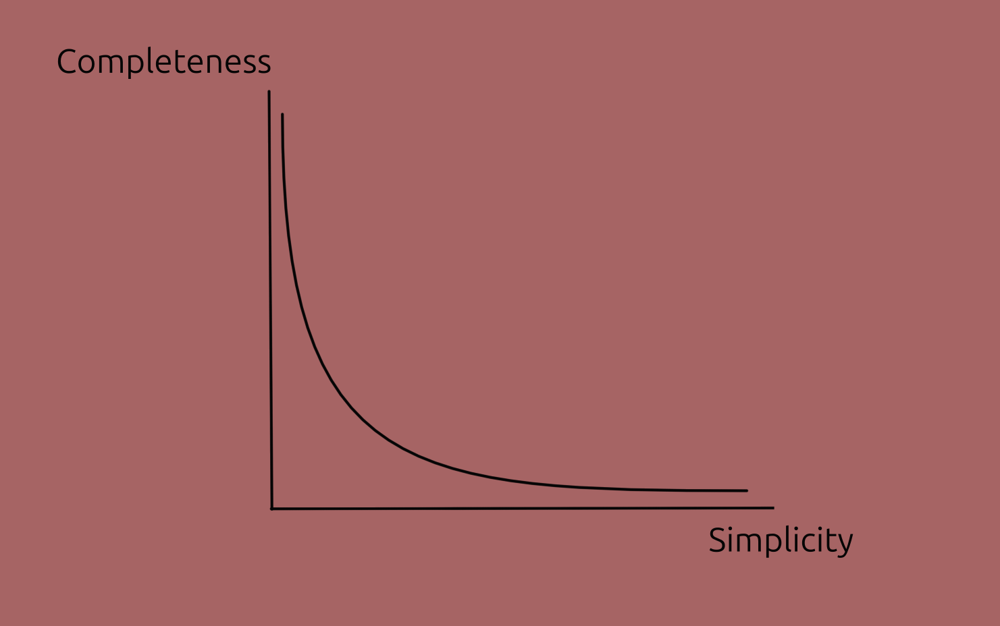
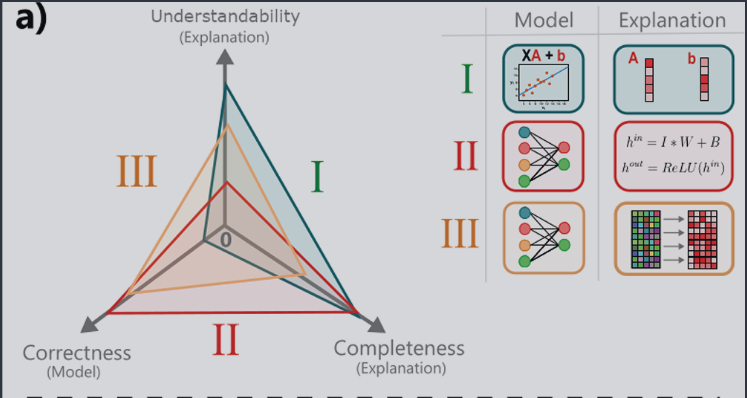

# Explainable AI - Concepts

These are some of my opinions and ideas after reading a few papers:

1. [Explaining Explanations: An Overview of Interpretability of Machine Learning][XX] (2018),
2. [Interpretable and Explainable Machine Learning for Materials Science and Chemistry][XAI4MAT] (2022),
3. [A Perspective on Explainable Artificial Intelligence Methods: SHAP and LIME][SHAP and LIME] (2024).

<!-- Also, a very interesting experiment in terms of explainability was <https://distill.pub>. -->

--------------------

## Explanations

Scientific models are expected to be explainable; that is, an expert human can respond to _why_ questions about it.

And yet, deep learning models' operation remains opaque.
So how can we explain deep-learning models? That is what this blog explores.

(Admittedly, in some cases we may be satisfied with the predictive power alone.)

### Definition

_Explanation_ can be defined in an intuitive way. First, phrase what we want to know as a "Why question", the answer is a candidate-explanation. Keep asking "Why" until satisfied. Call the process an explanation.

> [!NOTE]
> However, some questions are clearly useful and not "Why" questions, for example: "What role does this neuron play?" In certain sense, any question regarding the "behaviour" or operation of the model is valid, and should admit an explanation as a response.

### Characteristics

We can characterise explanations using:

- _Simplicity_: how easy to understand the explanation is. (The opposite term, _complexity_, could be used as well.)
        - This is correlated with how simple _the model itself_ is.
- _Completeness_: how accurately it describes the model's behaviour.

Completeness v. Simplicity tradeoff.

This trade-off isn't universal but just a common case, particularly in deep learning; some other models are straightforward, in which case both characteristics can be high.

### Predictive power

Predictive power is a characteristic of a model, not of an explanation of a model, but is often correlated to those: more predictive models tend to be more complex and the explanation tends to be more complex.

The reason to include it here is that _predictive power_ plays an important role deciding which model to use.

In the image below, note that _understandability_ replaces _simplicity_, and _correctness_ replaces _predictive power_.

 <!--other classes: w220, w420-->
    
    

    Image from <a href="https://pubs.acs.org/doi/10.1021/accountsmr.1c00244">paper</a> under <a href="https://creativecommons.org/licenses/by/4.0/">CC-BY-SA 4.0</a>
    

[XAI4MAT]: https://pubs.acs.org/doi/10.1021/accountsmr.1c00244
[SHAP and LIME]: https://onlinelibrary.wiley.com/doi/abs/10.1002/aisy.202400304
[XX]: http://arxiv.org/abs/1806.00069
