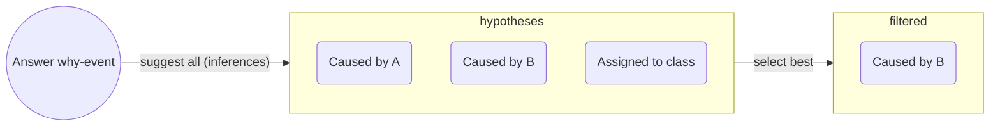

# What is an explanation?

Let's start with an example. Concepts are expanded in the remaining sections.

## An explanation example

You open a drawer, and a conversation with a friend starts.

> Friend: Why did the drawer slide out?\
> You: Because I pulled it out? Had I not, the drawer wouldn't have slide.

The answer is an _efficient_ cause. Aristotle proposed 4 causes: _efficient_ (mechanism), _formal_ (form, shape), _material_ (properties), _final_ (purposes).

Hume instead, understood causes through _counterfactuals_: X is the cause of why if _had X not happened, Y wouldn't have happened_. In the answer, that event is _pulling_.[^necessity]

> Friend: I _know_ that. But why does it slide _rather than_ opening like a lid?\
> You: Oh! I misunderstood. The drawer sits on rails allowing it to slide.

The "_rather than_ ..." is a contrast called _foil_, which may be implicit. _Foils_ make answering easier.

The friend may keep asking "Why" and eventually reject or accept the causal chain (or remain sceptical).

Notice the **social process** involved: we tried to guess the friend's actual _knowledge gap_ (first wrongly, he _knew_ that), and to emit relevant information. There are also other aspects that matter, such as testing the claim, suggesting a _foil_, and so forth.

## A definition of Explanation

We can start with an oversimplified definition of an _explanation_ (inspired by [1][lombrozo], [2][explanations_social], [3][hempel], but quite different from all those):

> An answer &mdash;usually a hypothesis or observation&mdash; that makes an event or relation between items expected or likely to the explainee (or to one-self). With this aim, explainers make use of causal inference, deduction accepted facts, comparison to a reference item, noting class membership and so forth. Prior beliefs or knowledge are used to constrain acceptable answers.

The _reference item_ is hinting to a _foil_. [Explanation in AI: insights from the social sciences][explanations_social] notes that _why-questions_ are usually contrastive questions, phrased as _why P rather than Q_ instead of _why P_. In this latter case, the _foil_ (Q) is implicit.

The definition is abstract, here are some examples: non-causal answers are: "Light interferes because it is a wave." or "It chirps because it's a bird." or "It chirps because it's happy." (foil here is a human singing.); causal hypotheses may be mechanistic (such as "Because of a force/push").

Importantly, not only _why-questions_ prompt explanations, but it is fine to a first approximation. Similarly, not only mechanistic causes are accepted as answer. In addition,

In section **2.1.2**, the same paper characterises an explanation as: a **cognitive process** of finding a cause; a **product**, resulting from the cognitive process; a **social process**, which involves communicating the product.

Let's now expand on the _cognitive_ and _social_ processes of an explanation (as I see them).

## The cognitive process of explanations

The _cognitive process_ is similar to the scientific method:

1. _Select_ what seems explanatory relevant (using prior knowledge),
2. _Infer_ possible causes of an event, known as _causal attribution_,
    - Or class membership etc.
3. _Weight_ the likelihood of each hypotheses.
4. _Accept_ until contradicted by experience or super-seeded (e.g. by a simpler explanation).

Inferring a cause (or positing a class membership) usually uses a logic inference method. These methods are recalled below with examples:

- Deductive: Light is a wave; all waves interfere; then light beams interfere,
- Inductive (generalisation): Bats are mammals; bats fly; maybe all mammals fly,
- Abductive: Light shows interference patterns, waves interfere, maybe light is a wave. It proposes a hypothesis to explain a fact (closest to what is done in the science).

The _inference to a cause_ is very important and sometimes not obvious. It is made obvious when we do it wrong. For example, imagine that the drawer (in the example) actually slides when we touch it, then our inferred cause was wrong.

Besides using prior knowledge, the way we come up with hypotheses may involve creativity, metaphors, analogies and be aided by methods or techniques; this post won't go further into this aspect.

The idea above can be summarised in a graph:

Now we expand on _causes_, _causal attribution_ and _abductive reasoning_ which are important pieces of the _cognitive process_.

### Causes

Aspects of causes already mentioned, but worth putting together, were:

- The cognitive process involves _inferring a cause_.
- Aristotle's proposed 4 kinds of _causal_ answers to a _why-question_. These explanations are not always exclusive, they can be complementary.
- Hume defined _causes_ as _counterfactuals_: A is the cause of B if, had A not happened, B wouldn't have happened. This view was formalised by Pearl and Halpern.

_Are all Aristotelian causes Humean causes?_ Efficient causes can be seen as counterfactuals, and both are common in science. The remaining 3 causes are not naturally seen as counterfactuals.

### Strength of a Hypothesis

The plausibility of a hypothesis or causal claim is affected by different aspects.

- **Simplicity**: if it involves a shorter chain of causes, it is preferred,
- **Generality**: if it explains other cases, it is preferred,
- **Prior knowledge/beliefs**
    - Conditions generation and veto of hypotheses. For example, "The drawer slides because it wants." may be ignored in different basis. Another illustrative example from [The structure and function of explanations][lombrozo]:
    > (...) If told that herring and tuna have a disease, naive participants are more likely to extend the property to wolffish, the more similar item, than to dolphins. However, among fishing experts, who can generate an explanation for why the property might hold (e.g. tuna contract the disease by eating infected herring), similarity is less predictive of property extensions. (...)

    - Aids selecting what seems causally / explanatory relevant from what is not. Consider two light beams interfering on a Sunday. The day is irrelevant (usually), we disregard a confounding factor.

I don't have much to say about _product_ (`2.`), so we jump to `3`.

## Social Process

The causal-hypothesis must then be communicated, and there are expectations about it.

[Gricean Maxims][gricean_maxims] are rules observed in _good_ communication. These rules can also be used as a guide for good _model explanations_.

1. **Informative** (Quantity): right amount of context and details,
2. **Truthful** (Quality, or Fidelity): Try to make it true,
3. **Relevance** (Relation): do not state things that aren't needed (provide insight),
4. **Manner** (clarity): express it in elegant terms.

## Metaphors

The Machine and The Agent (click to open)

In the scientific and science-adjacent domains, models are conceptualised as _machines_:

1. They have parts, each with a function, a role,
2. They correspond with some aspect of the reality being modelled.

Outside of science or the technical domain, they're conceptualised as _human-like agents_:

1. They tend to be explained in human terms,
2. They are expected to be reliable, consistent, ...

So explanations are answers to _why-questions_; _good_ explanations respect the Gricean maxims, and will be dependent on the audience (their preferred style, expectations, expertise).

The table below is a summary of the ideas above

| Perspective      | Model is a… | Preferred Explanation style           | Audience            |
| ---------------- | ----------- | --------------------------- | ------------------- |
| **Scientific**   | Machine     | Mechanistic, causal, formal | Experts             |
| **Human-facing** | Agent       | Intentional, narrative      | Users, stakeholders |

Many other metaphors could be proposed.

In the next post we use our knowledge to define Explainable AI.

------------

List of sources used in this blogpost

1. [Studies in the logic of explanation][hempel] (1948). I just read the first few pages),
1. [On the mechanization of abductive logic][abductive_logic] (1973). The first page is quite interesting.
<!-- A **deduction** (proof) is e.g. "All cats are animals (I); animals are big (II); then cats are big (III)", whereas **abduction** (hypothesis) would be "III; I; maybe II" notice the _maybe_ (anti-clockwise rotation). Another anti-clockwise rotation takes us to **induction** (generalisation,hypothesis): "II; III; maybe all I". -->
1. [A Unified Approach to Interpreting Model Predictions][shap_values] (2017): paper proposing SHAP, that is, showing Shapley values as the best coefficients in linear combination of features, given 3 requirements (local accuracy, missingness and consistency),
1. [Explaining Explanations: An Overview of Interpretability of Machine Learning][xx] (2018),
1. [Producing radiologist-quality reports for interpretable artificial intelligence][xai_rnn_radiology] (2018): a "case study",
1. The paper ["Explanation in artificial intelligence: insights from the social sciences"][explanations_social] (2019, 38 pages). Once the why-cause is found (diagnosis), it may be communicated, making rules of conversation relevant: [Gricean Maxims of Communication][gricean_maxims] (blog-post), or [Wikipedia's][wikipedia_gricean].
   - The definition of explanation extends previous work by Lombrozo on [The structure and function of explanations][lombrozo] (2006).
1. [The perils and pitfalls of explainable AI: Strategies for explaining algorithmic decision-making][perils_and_pitfalls] (2021): emphasis on socio-political aspects,
1. [Interpretable and Explainable Machine Learning for Materials Science and Chemistry][xai4mat] (2022),
1. Blog Posts: [What is Explainable AI?][what_is_xai] (2022) and from [IBM][xai_ibm],
1. [A Perspective on Explainable Artificial Intelligence Methods: SHAP and LIME][using_shap_lime] (2024).

<!-- Also, a very interesting experiment in terms of explainability was <https://distill.pub>. -->

[xai4mat]: https://pubs.acs.org/doi/10.1021/accountsmr.1c00244
[using_shap_lime]: https://onlinelibrary.wiley.com/doi/abs/10.1002/aisy.202400304
[xx]: http://arxiv.org/abs/1806.00069
[shap_values]: https://proceedings.neurips.cc/paper/2017/hash/8a20a8621978632d76c43dfd28b67767-Abstract.html
<!-- [XAI for whom]: http://arxiv.org/abs/2106.05568 -->
[what_is_xai]: https://www.sei.cmu.edu/blog/what-is-explainable-ai/
[xai_ibm]: https://www.sei.cmu.edu/blog/what-is-explainable-ai/
[xai_rnn_radiology]: https://arxiv.org/abs/1806.00340
[perils_and_pitfalls]: https://www.sciencedirect.com/science/article/pii/S0740624X21001027
[abductive_logic]:https://www.ijcai.org/Proceedings/73/Papers/017.pdf
[explanations_social]: https://www.sciencedirect.com/science/article/pii/S0004370218305988
[gricean_maxims]: https://effectiviology.com/principles-of-effective-communication/
[wikipedia_gricean]: https://en.wikipedia.org/wiki/Cooperative_principle
[lombrozo]: https://fitelson.org/few/few_08/lombrozo_reading.pdf
[hempel]: https://fitelson.org/woodward/hempel_oppenheim.pdf

[^necessity]: Talking about _necessary_ and _sufficient_ causes would overload the example. _Counterfactuals_ use the word _happen_, so it's an event rather than a condition: The spark of a lighter would be the _cause_ of a fire, but oxygen would still be a _necessary_ cause (or condition, or setting).
