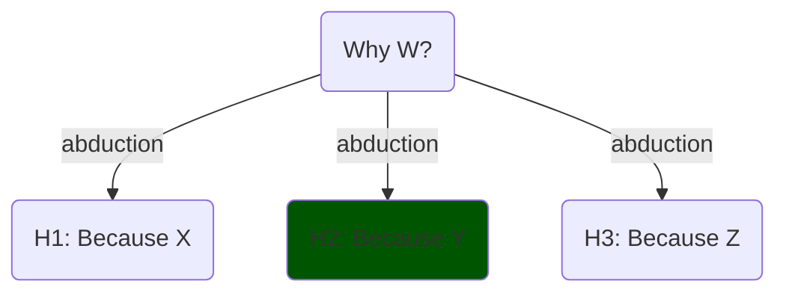

# Explaining Things

The goals of the post are:
1. Discuss general aspects about explanations,
2. Propose a definition of explainable AI focusing on _model explainability_.

------------

## What is an explanation?

[Explanations in AI, section 2.1.2][explanations_social] **defines explanation** as a 3-legged concept. This is itself an extension of previous work by Lombrozo on [The structure and function of explanations][lombrozo]. Central to their model are the definitions:

- **Causal explanation**: Or just _explanation_. Involves:
    - Cognitive process: causal attribution[^1]; that is, finding the causes of an event,
    - Product: The result,
    - Social process: communicating it.

### Causal Attribution

_Why X_ can be rephrased as either _What is X for_, its purpose, or _What is the cause of X_, that is, the events leading to X.

We are interested in the latter. Hume understood causes with _counterfactuals_: A is the cause of B if, had A not happened, B wouldn't have happened. This view was formalised by Pearl and Halpern.

It normally involves an inference for the _best_ cause (best candidate hypothesis for cause), or in steps:

1. Hypothesis generation using abductive inference,
   - These will be _proposed_ causes/explanations/
2. Selection of the best hypothesis

### Causal Explanation / Good Explanations

The causal-hypothesis must then be communicated, and there are expectations about it.

[Gricean Maxims][gricean_maxims] are rules observed in _good_ communication. We can use these rules as a guide for good _model explanations_ as well.

1. **Informative** (Quantity): right amount of context and details,
2. **Truthful** (Quality, or Fidelity): Try to make it true,
3. **Relevance** (Relation): do not state things that aren't needed (provide insight),
4. **Manner** (clarity): express it in elegant terms.

## Explainable AI

Having defined _causal explanations_ we can define _model explainability_ &mdash; the focus of  Explainable Artificial Intelligence&mdash as:

> finding the causes underlying a model's predictions or operation,

But can a model be pragmatically considered explainable if it can not be communicated to the target audience?

We can amend the definition of _model explainability_ to better fit the 3-legged definition of explanations given earlier:

> the degree to which humans can effectively answer questions about a model's predictions or operation, either directly or using explainability methods.

_Questions_ includes more than just why-questions; _effectively_ includes the social and communicational aspect of it (which Grice's Maxims aid).

### Trade-off

One trade-off is that each audience will demand certain guarantees, and have expectations, and expertise, but we do not want lose much fidelity to the original model.

Simplification loses fidelity. Care must be taken to make "things as simple as possible, but not simpler" or there is risk of **oversimplifying**. This is compounded by the fact that more complex and accurate models tend to be less explainable.

This is not universal, but we could represent this common case as:

    
    
Model accuracy vs Model explainability tradeoff.

## Map of XAI

An interesting map of XAI is given in the survey [Principles and practice of explainable ML][principles_and_practice] (2021).

Most _classic ML_ models are in the dashed area under **Model types** column.

_Classic ML_ models are usually _transparent_ (intrinsically explainable) but _may_ benefit from post-hoc (post training) explanations, such as visualising it. When transparency is key and the predictions are accurate enough, these may be preferred over DL models.

    
    

    Image from <a href="https://www.frontiersin.org/journals/big-data/articles/10.3389/fdata.2021.688969/full">paper</a> under <a href="https://creativecommons.org/licenses/by/4.0/">CC-BY</a>
    

The focus here though, is explaining _deep learning_ models. These are usually _opaque_ ("_black-box_") models, and their accuracy is usually higher than classic ML models.

In other words, classical ML and DL models each have their use-cases.

### Explanation kinds

The survey [Principles and practise of explaining ML models][principles_and_practice] also includes a great table of **explanation kinds**. A modified version of the table is below:

| Explanation         | Advantages    | Disadvantages | Question |
|---------------------|---------------|---------------|----------|
| **Local explanations** | Explains the model's behaviour in a local area of interest. Operates on instance-level explanations. | Explanations do not generalize on a global scale. Small **perturbations** might result in very different explanations.| How do small perturbations affect the output / prediction? |
| **Examples**      | Representative items for each class provide insights about the model's internal reasoning. | Examples require human selection. They do not explicitly state what parts of the example influence the model. | How do inputs from different classes compare? And same? |
| **Feature relevance** | They operate on an instance level (some can operate globally). | Methods may make assumptions which do not hold (e.g. feature independence, linearity).| Which input features are most important? |
| **Simplification**  | Simple surrogate models explain opaque ones. | Surrogate models may not approximate original models well. | Can we get local insights by using a simpler model? |
| **Visualizations**  | Easier to communicate to non-technical audiences. Most approaches are intuitive and not hard to implement. | There is an upper bound on how many features can be considered at once. Humans must inspect plots to derive explanations. | Class boundaries? |

We should remember that:

> Relying on only one technique will only give us a partial picture of the whole story, possibly missing out important information. Hence, combining multiple approaches together provides for a more cautious way to explain a model. (...) At this point we would like to note that there is no established way of combining techniques (in a pipeline fashion),

In the next posts, we focus on **methods** that aid _causal attribution_ (or cognitive process) with a scientific audience in mind.

--------------------

Aside: Methaphors

## The Machine and The Agent

In the scientific and science-adjacent domains, models are conceptualised as _machines_:

1. They have parts, each with a function, a role,
2. They correspond with some aspect of the reality being modelled.

Outside of science or the technical domain, they're conceptualised as _human-like agents_:

1. They tend to be explained in human terms,
2. They are expected to be reliable, consistent, ...

The audiences' have different goals or expectations and expertise (which exists within each level as well). We could also select more metaphors and more audiences, or make divisions within each.

| Perspective      | Model is a… | Explanation style           | Audience            |
| ---------------- | ----------- | --------------------------- | ------------------- |
| **Scientific**   | Machine     | Mechanistic, causal, formal | Experts             |
| **Human-facing** | Agent       | Intentional, narrative      | Users, stakeholders |

So explanations are answers to _why-questions_; _good_ explanation is dependent on the audience (their expertise, expectations) and so forth.

Sources

1. [On the mechanization of abductive logic][abductive_logic] (1973). The first page is quite interesting.
<!-- A **deduction** (proof) is e.g. "All cats are animals (I); animals are big (II); then cats are big (III)", whereas **abduction** (hypothesis) would be "III; I; maybe II" notice the _maybe_ (anti-clockwise rotation). Another anti-clockwise rotation takes us to **induction** (generalisation,hypothesis): "II; III; maybe all I". -->
1. [A Unified Approach to Interpreting Model Predictions][shap_values] (2017): paper proposing SHAP, that is, showing Shapley values as the best coefficients in linear combination of features, given 3 requirements (local accuracy, missingness and consistency),
1. [Explaining Explanations: An Overview of Interpretability of Machine Learning][xx] (2018),
1. [Producing radiologist-quality reports for interpretable artificial intelligence][xai_rnn_radiology] (2018): a "case study",
1. The paper ["Explanation in artificial intelligence: insights from the social sciences"][explanations_social] (2019, 38 pages). Once the why-cause is found (diagnosis), it may be communicated, making rules of conversation relevant: [Gricean Maxims of Communication][gricean_maxims] (blog-post), or [Wikipedia's][wikipedia_gricean].
1. [Principles and practice of explainable machine-learning][principles_and_practice] (2021, 25 pages): Sections 8&ndash;11 are a useful review of explainability methods.
1. [The perils and pitfalls of explainable AI: Strategies for explaining algorithmic decision-making][perils_and_pitfalls] (2021): emphasis on socio-political aspects,
1. [Interpretable and Explainable Machine Learning for Materials Science and Chemistry][xai4mat] (2022),
1. Blog Posts: [What is Explainable AI?][what_is_xai] (2022) and from [IBM][xai_ibm],
1. [A Perspective on Explainable Artificial Intelligence Methods: SHAP and LIME][using_shap_lime] (2024).

<!-- Also, a very interesting experiment in terms of explainability was <https://distill.pub>. -->

[xai4mat]: https://pubs.acs.org/doi/10.1021/accountsmr.1c00244
[using_shap_lime]: https://onlinelibrary.wiley.com/doi/abs/10.1002/aisy.202400304
[xx]: http://arxiv.org/abs/1806.00069
[shap_values]: https://proceedings.neurips.cc/paper/2017/hash/8a20a8621978632d76c43dfd28b67767-Abstract.html
<!-- [XAI for whom]: http://arxiv.org/abs/2106.05568 -->
[what_is_xai]: https://www.sei.cmu.edu/blog/what-is-explainable-ai/
[xai_ibm]: https://www.sei.cmu.edu/blog/what-is-explainable-ai/
[xai_rnn_radiology]: https://arxiv.org/abs/1806.00340
[perils_and_pitfalls]: https://www.sciencedirect.com/science/article/pii/S0740624X21001027
[principles_and_practice]: https://www.frontiersin.org/journals/big-data/articles/10.3389/fdata.2021.688969/full
[abductive_logic]:https://www.ijcai.org/Proceedings/73/Papers/017.pdf
[explanations_social]: https://www.sciencedirect.com/science/article/pii/S0004370218305988
[gricean_maxims]: https://effectiviology.com/principles-of-effective-communication/
[wikipedia_gricean]: https://en.wikipedia.org/wiki/Cooperative_principle
[lombrozo]: https://fitelson.org/few/few_08/lombrozo_reading.pdf
