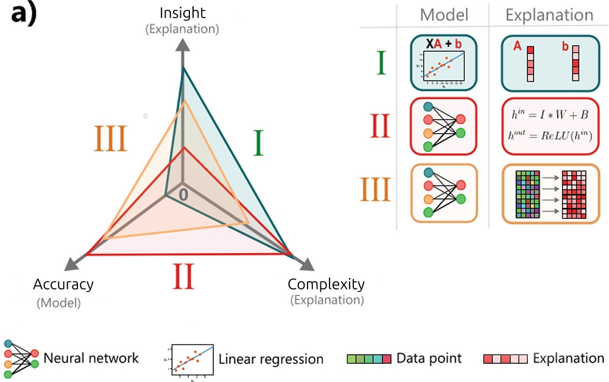

# Explainable AI - Concepts

One focus of Explainable Artificial Intelligence (XAI) is _model explainability_, which could be defined as:

> the degree to which humans can answer questions about a model's predictions or operation, either directly or using explainability methods.

[Explanations in AI, section 2.1.3][explanations_social] includes _why_, _what_ and _how_ questions. The definition given above uses "questions" to include these cases.

The answers to such questions &mdash;the explanations&mdash; are themselves hypotheses. And that which best explains the data is selected. Of course, it could be none of them is good enough.

Note: This post assumes a scientific audience, and the methods are tools for explaining deep learning models to other scientists (or ourselves).

## A trade-off

Complex and accurate models tend to be less explainable. This is referred to as the Explainability v. Accuracy trade-off (see image below). The finding is an empirical rather than theoretical.

    
    
Model accuracy vs Model explainability tradeoff.

## Dimensions of interest

Here, we emphasise two _explanation_ dimensions, and one _model_ dimension:[^1]

- **Complexity** : expertise is needed to understand the explanation,
- **Insight** : degree to which an explanation enables prediction or conceptual understanding,
- **Accuracy** (model): predictive performance of the underlying models.

Complexity-Insight-Accuracy trade-off:

    
    

    Dimensions of interest linked in a radial plot. The image was altered from <a href="https://pubs.acs.org/doi/10.1021/accountsmr.1c00244">paper</a> under <a href="https://creativecommons.org/licenses/by/4.0/">CC-BY</a>.
    

Other dimensions, that the posts do not focus on:

- **Other variables**: intrinsic-global, intrinsic-local, extrinsic-global, and extrinsic-local explanations. For a given category from the 4 above, we can think of explainability as $X_p = \frac{I}{C}$ or plain words: e**X**plainability equals **I**nsight divided by **C**omplexity.
- **Fidelity**: how accurately the explanation reflects the true behaviour of the model.

## Map of XAI

An interesting map of XAI is given in the survey [Principles and practice of explainable ML][principles_and_practice] (2021); and is reproduced below:

    
    

    Image from <a href="https://www.frontiersin.org/journals/big-data/articles/10.3389/fdata.2021.688969/full">paper</a> under <a href="https://creativecommons.org/licenses/by/4.0/">CC-BY</a>
    

Most _classic ML_ models are in the dashed area under **Model types** column.

These are _transparent_ (intrinsically explainable) but _may_ also benefit of post-hoc (post training) explanations, such as visualising it. When transparency is key and the predictions are accurate enough, these may be preferred.

The focus here though, is explaining _deep learning_ models.
These are usually _opaque_ ("_black-box_") models, but their predictive power is usually higher than classic ML models.

In other words, there are use-cases for each classical and deep learning _models_.

When using explanation techniques, we should remember that (same paper):

> Relying on only one technique will only give us a partial picture of the whole story, possibly missing out important information. Hence, combining multiple approaches together provides for a more cautious way to explain a model. (...) At this point we would like to note that there is no established way of combining techniques (in a pipeline fashion),

## Explanation kinds

The survey [Principles and practise of explaining ML models][principles_and_practice] also includes a great table of **explanation kinds**.
A modified version of the table is below:

| Explanation         | Advantages    | Disadvantages | Question |
|---------------------|---------------|---------------|----------|
| **Local explanations** | Explains the model's behaviour in a local area of interest. Operates on instance-level explanations. | Explanations do not generalize on a global scale. Small **perturbations** might result in very different explanations.| How do small perturbations affect the output / prediction? |
| **Examples**      | Representative items for each class provide insights about the model's internal reasoning. | Examples require human selection. They do not explicitly state what parts of the example influence the model. | How do inputs from different classes compare? And same? |
| **Feature relevance** | They operate on an instance level (some can operate globally). | Methods may make assumptions which do not hold (e.g. feature independence, linearity).| Which input features are most important? |
| **Simplification**  | Simple surrogate models explain opaque ones. | Surrogate models may not approximate original models well. | Can we get local insights by using a simpler model? |
| **Visualizations**  | Easier to communicate to non-technical audiences. Most approaches are intuitive and not hard to implement. | There is an upper bound on how many features can be considered at once. Humans must inspect plots to derive explanations. | Class boundaries? |

In the next post, we look at methods.

--------------------

More on Communicating Explanations

## Audience

The definition given earlier uses <q>can answer questions</q> without considering that different audiences have different expertise and goals.

This posts is concerned with methods to "find explanations" to be explained to a scientific audience. What about for any audience?

Assuming we have all the explanations at our disposal, our task would be twofold:

1. Select a relevant one for the audience,
2. Communicate it correctly ([Gricean maxims][wikipedia_gricean]).

Scientist may see a deep learning model through the metaphor of a machine. Next, I describe two metaphors, for different audiences.

### The Machine and The Agent

Let's assume we have a set of explanations at our disposal. The [Gricean Observations][wikipedia_gricean] of effective communication can help us, if taken as a prescription.

The maxims are that statements (such as explanations) during effective communication are **true** (quality, fidelity), **informative** (quantity, not too long or short), **relevant** (relation, filling audience gaps) and **clear** (manner, avoid ambiguity).

In the scientific and science-adjacent domains, models are conceptualised as _machines_:

1. They have parts, each with a function, a role,
2. They correspond with some aspect of the reality being modelled.

Outside of science or the technical domain, they're conceptualised as _human-like agents_:

1. They tend to be explained in human terms,
2. They are expected to be reliable, consistent, ...

The audiences' have different goals or expectations and expertise (which exists within each level as well). We could also select more metaphors and more audiences, or make divisions within each.

| Perspective      | Model is a… | Explanation style           | Audience            |
| ---------------- | ----------- | --------------------------- | ------------------- |
| **Scientific**   | Machine     | Mechanistic, causal, formal | Experts             |
| **Human-facing** | Agent       | Intentional, narrative      | Users, stakeholders |

So explanations are answers to _why-questions_ but a _good_ explanation is dependent on the audience (their expertise, expectations) and so forth.

In a sense, I would be implicitly considering what are those _good_ explanations, which in term is implicitly assuming a scientific audience looking for methods to explain models that _do not lose much fidelity to the original_.

### Constrains on explanations

It seems plausible that some explanations can't be simplified further without being misleading or false, hence being a constrain _of the problem itself_.

Sources

1. [On the mechanization of abductive logic][abductive_logic] (1973). The relation to this post is a bit far fetched though: _abductive logic_ is a key component of explanations. The first page is quite interesting.
<!-- A **deduction** (proof) is e.g. "All cats are animals (I); animals are big (II); then cats are big (III)", whereas **abduction** (hypothesis) would be "III; I; maybe II" notice the _maybe_ (anti-clockwise rotation). Another anti-clockwise rotation takes us to **induction** (generalisation,hypothesis): "II; III; maybe all I". -->
1. [A Unified Approach to Interpreting Model Predictions][shap_values] (2017): paper proposing SHAP, that is, showing Shapley values as the best coefficients in linear combination of features, given 3 requirements (local accuracy, missingness and consistency),
1. [Explaining Explanations: An Overview of Interpretability of Machine Learning][xx] (2018),
1. [Producing radiologist-quality reports for interpretable artificial intelligence][xai_rnn_radiology] (2018): a "case study",
1. The paper ["Explanation in artificial intelligence: insights from the social sciences"][explanations_social] (2019, 38 pages). Once the why-cause is found (diagnosis), it may be communicated, making rules of conversation relevant: [Gricean Maxims of Communication][gricean_maxims] (blog-post), or [Wikipedia's][wikipedia_gricean].
1. [Principles and practice of explainable machine-learning][principles_and_practice] (2021, 25 pages): Sections 8&ndash;11 are a useful review of explainability methods.
1. [The perils and pitfalls of explainable AI: Strategies for explaining algorithmic decision-making][perils_and_pitfalls] (2021): emphasis on socio-political aspects,
1. [Interpretable and Explainable Machine Learning for Materials Science and Chemistry][xai4mat] (2022),
1. Blog Posts: [What is Explainable AI?][what_is_xai] (2022) and from [IBM][xai_ibm],
1. [A Perspective on Explainable Artificial Intelligence Methods: SHAP and LIME][using_shap_lime] (2024).

<!-- Also, a very interesting experiment in terms of explainability was <https://distill.pub>. -->

[xai4mat]: https://pubs.acs.org/doi/10.1021/accountsmr.1c00244
[using_shap_lime]: https://onlinelibrary.wiley.com/doi/abs/10.1002/aisy.202400304
[xx]: http://arxiv.org/abs/1806.00069
[shap_values]: https://proceedings.neurips.cc/paper/2017/hash/8a20a8621978632d76c43dfd28b67767-Abstract.html
<!-- [XAI for whom]: http://arxiv.org/abs/2106.05568 -->
[what_is_xai]: https://www.sei.cmu.edu/blog/what-is-explainable-ai/
[xai_ibm]: https://www.sei.cmu.edu/blog/what-is-explainable-ai/
[xai_rnn_radiology]: https://arxiv.org/abs/1806.00340
[perils_and_pitfalls]: https://www.sciencedirect.com/science/article/pii/S0740624X21001027
[principles_and_practice]: https://www.frontiersin.org/journals/big-data/articles/10.3389/fdata.2021.688969/full
[abductive_logic]:https://www.ijcai.org/Proceedings/73/Papers/017.pdf
[explanations_social]: https://www.sciencedirect.com/science/article/pii/S0004370218305988
[gricean_maxims]: https://effectiviology.com/principles-of-effective-communication/
[wikipedia_gricean]: https://en.wikipedia.org/wiki/Cooperative_principle

[^1]: **Insight** could be conceived, at least partially, as the [Gricean maxim][wikipedia_gricean] of relation (relevance). **Complexity**: If we think of a specific audience, we could remove this characteristic, because only explanations that are of quality and relevant should be considered, and that implies of the right level of complexity. There is also an issue: it may not be possible to explain a certain event without a certain level of complexity; in other words, the are constrains given by the social interaction and constrains given by the problem itself and the goals.

<!--Parts I removed to keep it shorter.-->
<!-- DL models are usually complex, and have low _intrinsic_ explainability. Yet, they may allow for insightful _extrinsic_ explanations. For a model, accuracy, predictive power and complexity are also inter-related. -->
<!-- _How does the output change_ if we change this or that feature? _Does it fail in some specific cases_? -->
<!-- how much the explanation empowers users to understand the model, either intuitively or quantitatively. -->

<!-- > D is a collection of data (facts, observations, givens).\ -->
<!-- > H explains D (would, if true, explain D).\ -->
<!-- > No other hypothesis can explain D _as well as_ H does.\ -->
<!-- > Therefore, H is probably true. -->

<!-- This defines a kind of inference / logical reasoning, called _abduction_ (besides induction and deduction), which ends up in a hypothesis or explanation. The process is also referred to as _inference to the best explanation_ (or to the best hypothesis). The selection is based on _how well_ it explains the events. -->
