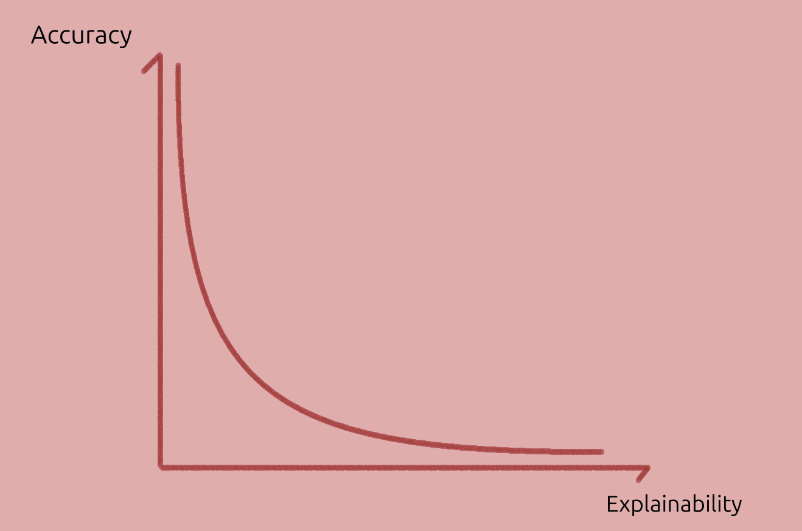
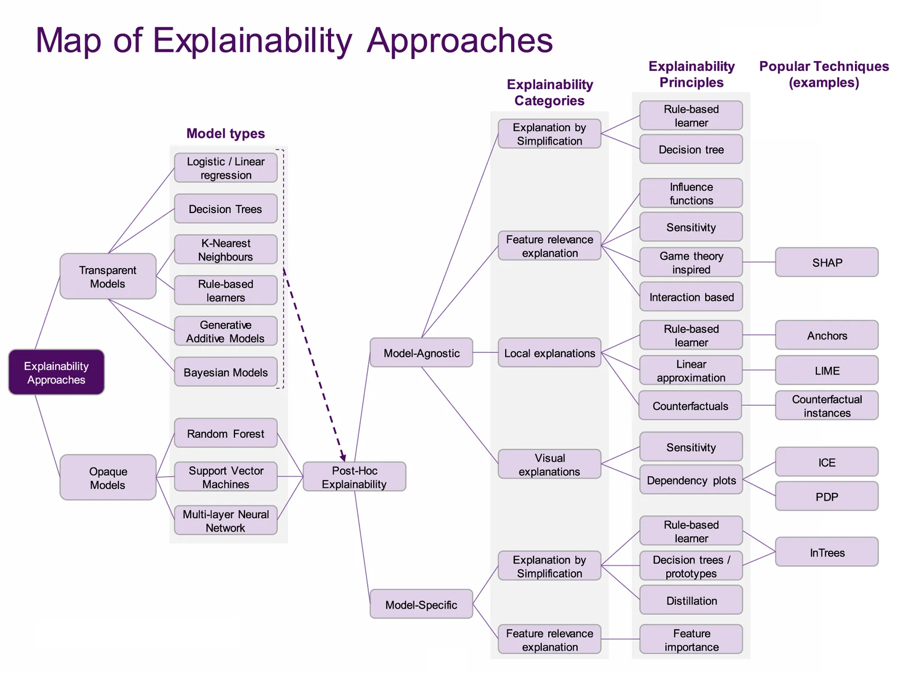

# Explainable AI

Explanations were defined and characterised in [explanations](./explanation.md). This post explores the connection of _explanations_ to _deep learning models_.

----------------

## Model Explainability

Explainable AI (XAI) is primarily about explaining models and their outputs. _Model explainability_ can be defined as:

> The degree to which we can answer questions about a model and its output. The _answers_ are audience and context dependent. The audience, in some cases, may be ourselves.

Since there are many definitions and goals of XAI we should always define the term (even approximately) or to cite a definition, and to state _which problems_ our ideas aim to solve.

Examples of classifications of model explanations are:

- Intrinsic vs Extrinsic
    - Intrinsic or Transparency: looks at the internal mechanics, at the roles of layers, neurons, weights; also at the complexity of the model and the input types.
    - Extrinsic or "Black Boxness"[^2]: looks at input-outputs relations, may also use clustering and visualisation techniques.
- Global (valid for all inputs) vs Local (for specific inputs)

### Trade-offs

In deep learning practice, tradeoffs abound. For example, explainability _tends to_ decrease the more complex a model is. In turn, complexity or size of a model tend to increase accuracy.

    
    
Model accuracy vs Model explainability tradeoff.

Moreover, simple explanations can **oversimplify** its operation, or lack **generality**.

## Out of Distribution

Let's take an imaginary model, $y = f(u)$, $f$ being the model, $u$ being the proportion of people with an umbrella and $y$ the probability of rain. The model reaches low evaluation error and everyone is happy.

However, the model consistently fails to predict rains when people didn't take the umbrella. Why could this happen? Some of the reasons below were inspired by the paper "[The Mythods of Model Interpretability][mythos]":

1. The model _undefitted_ the data, and we may need a better model.
1. The dataset is _not representative_ the deployment environment, and the model can't generalise out of training distribution. Can it be fixed if we don't have those datapoints?
1. The approach itself was incorrect: we use variables that promote _association rather than causation_.

Selecting possible causal variables, such as pressure and temperature, rather than the fraction of humans carrying out an umbrella, could help to make it more accurate, and even more explainable. But does it have _all_ the _causal inputs_? Why do we expect it to work out of distribution, though?[^1]

A subset of causal-variables may do for a good-enough approximation, and even generale well out of distribution. In some cases though, it may be enough to have a correlation model, but they should be distinguished.

Selecting those variables is not very easy, though. An expert must pick known causes-effects pairs as inputs-outputs to train a model, but others may unknowingly build a correlation model instead.

> It is hard to predict whether a model will work out of distribution without knowing what it has learnt. Knowing what a model has learnt is part of the XAI discipline, both opening the box, or carefully comparing its outputs.

## Model Insights from Comparisons

How many ways do we have to make comparisons? Probably dozens. Analogies, metaphors, counterfactuals, a reference case (opposite or similar), a prototype or class-assignment (generalisation uses comparison).

_Counterfactuals_ ask _What would happen if this other input (fact) were used instead of the former one_, or if one feature is changed slightly? They are also similar to _What ifs_ (as the question shows).

Counterfacturals and other comparisons can help to explain models without opening the box.

For a model, _counterfactuals_ are yet another prediction, but the question is helpful because that is one way humans explain things. We can use them as a proxy to "understand how the model is thinking" (that is, by comparing results or inferences).

In a similar fashion to counterfactuals, we can compare with reference inputs.

<!-- (A logic-inference section could be added, but at the moment I don't see it adding much useful information.) -->

<!-- ## Higher-Level Aspects of Networks -->
<!---->
<!-- The recognition of higher level patterns in graph can also span across methods. -->
<!---->
<!-- These can even be inspired by other networks or graphs; for example, insect colonies can be considered as graphs of insect-nodes and pheromone-edges, and certain nodes have roles and tasks they specialise on. A similar situation can be postulated to happen in human networks, and in neural (biological and artificial) networks, where the node is affected by, and also affects other nodes. -->
<!---->
<!-- A basic description of graph and networks and how there can be transfer learning between the different areas can be found in [Siemens - Connectivism][connectivism_siemens] and particularly in [Downes - Connectivism][connectivism_downes]. -->

## Overview of methods

There are many methods to identify causes or relevant properties on models, that help explain how they work. Some of them include counterfactuals and comparison, in the same sense as used in our previous section.

For all audiences, we can group these methods into more general categories, and then go into specific cases for a certain audience.

### Kinds of Methods

The survey [Principles and practise of explaining ML models][principles_and_practice] includes a table of **method kinds**. A modified version of the table is below:

| Kind         | Advantages    | Disadvantages | Question |
|---------------------|---------------|---------------|----------|
| **Local explanations** | Explains the model's behaviour in a local area of interest. Operates on instance-level explanations. | Explanations do not generalize on a global scale. Small **perturbations** might result in very different explanations.| How do small perturbations affect the output / prediction? |
| **Examples**      | Representative items for each class provide insights about the model's internal reasoning. | Examples require human selection. They do not explicitly state what parts of the example influence the model. | How do inputs from different classes compare? And same? |
| **Feature relevance** | They operate on an instance level (some can operate globally). | Methods may make assumptions which do not hold (e.g. feature independence, linearity).| Which input features are most important? |
| **Simplification**  | Simple surrogate models explain opaque ones. | Surrogate models may not approximate original models well. | Can we get local insights by using a simpler model? |
| **Visualizations**  | Easier to communicate to non-technical audiences. Most approaches are intuitive and not hard to implement. | There is an upper bound on how many features can be considered at once. Humans must inspect plots to derive explanations. | Class boundaries? |

A method not listed there are text explanations, which can be generated from an RNN or a language model, reading the model's internal state (for example, this can generate captions).

We should remember that:

> Relying on only one technique will only give us a partial picture of the whole story, possibly missing out important information. Hence, combining multiple approaches together provides for a more cautious way to explain a model. (...) At this point we would like to note that there is no established way of combining techniques (in a pipeline fashion),

In the next posts, we focus on **methods** that aid _causal attribution_ (or cognitive process) with a scientific audience in mind.

### Map of XAI

An interesting map of XAI is given in the survey [Principles and practice of explainable ML][principles_and_practice] (2021).

Most _classic ML_ models are in the dashed area under **Model types** column.

_Classic ML_ models are usually _transparent_ (intrinsically explainable) but _may_ benefit from post-hoc (post training) explanations, such as visualising it. When transparency is key and the predictions are accurate enough, these may be preferred over DL models.

    
    

    Image from <a href="https://www.frontiersin.org/journals/big-data/articles/10.3389/fdata.2021.688969/full">paper</a> under <a href="https://creativecommons.org/licenses/by/4.0/">CC-BY</a>
    

To the visual explanations, t-SNE, PCA and other dimensionality reduction techniques can be added.

The focus here though, is explaining _deep learning_ models. These are usually _opaque_ ("_black-box_") models, and their accuracy is usually higher than classic ML models.

<!-- In other words, classical ML and DL models each have their use-cases. -->

----------------

Sources

1. [The Mythos of Model Interpretability][mythos] (2018), excellent and easy-to-read. They consider two interpretability strategies:
   - _Transparency_ (intrinsic explainability), divided into 3 levels `1.` _simulatability_ or simplicity, `2.` _decomposability_ or part-role mapping, and `3.` _algorithmic training_ which focuses on error, loss, convergence.);
   - _Post hoc_ interpretability (black box / extrinsic explainability): breaks down techniques such as textual explanations using RNNs, visual explanations, local, by example and so forth.
1. [A Unified Approach to Interpreting Model Predictions][shap_values] (2017): paper proposing SHAP, that is, showing Shapley values as the best coefficients in linear combination of features, given 3 requirements (local accuracy, missingness and consistency),
1. [Explaining Explanations: An Overview of Interpretability of Machine Learning][xx] (2018),
1. [Producing radiologist-quality reports for interpretable artificial intelligence][xai_rnn_radiology] (2018): a "case study",
1. [The Book of Why][tbow] (2018): The introduction and first chapter were read in detail, only the part of interest for XAI (to my judgement) is discussed here, comparison and counterfactuals. It's interesting but may be more useful in other areas (like medical sciences, economics etc.)
1. [The perils and pitfalls of explainable AI: Strategies for explaining algorithmic decision-making][perils_and_pitfalls] (2021): emphasis on socio-political aspects,
1. [Interpretable and Explainable Machine Learning for Materials Science and Chemistry][xai4mat] (2022),
1. [Principles and practice of explainable machine-learning][principles_and_practice] (2021, 25 pages): Sections 8&ndash;11 are a useful review of explainability methods.
1. [A Perspective on Explainable Artificial Intelligence Methods: SHAP and LIME][using_shap_lime] (2024).

<!-- Also, a very interesting experiment in terms of explainability was <https://distill.pub>. -->

[mythos]: https://dl.acm.org/doi/10.1145/3236386.3241340

[perils_and_pitfalls]: https://www.sciencedirect.com/science/article/pii/S0740624X21001027

[principles_and_practice]: https://www.frontiersin.org/journals/big-data/articles/10.3389/fdata.2021.688969/full

[shap_values]: https://proceedings.neurips.cc/paper/2017/hash/8a20a8621978632d76c43dfd28b67767-Abstract.html

[tbow]: https://en.wikipedia.org/wiki/The_Book_of_Why

[using_shap_lime]: https://onlinelibrary.wiley.com/doi/abs/10.1002/aisy.202400304

[xai_rnn_radiology]: https://arxiv.org/abs/1806.00340

[xai4mat]: https://pubs.acs.org/doi/10.1021/accountsmr.1c00244

[xx]: http://arxiv.org/abs/1806.00069

<!-- As noted in the previous post, the "questions" may be implicit; and it's common that the question, implicit or explicit is a _contrastive why-question_. -->

<!-- It's interesting to consider, that we ourselves can't really inspect our own models within the brain. We a human explains a model, there is still the "human black box", but one which we trust, maybe because of human-human similarities. -->

[^1]: Could metaphors and analogies (from experience) be the missing ingredient of this to succeed? Could using causal models help to overcome these problems? How can we make a model that uses analogies?
[^2]: Also post-hoc explainability, opaqueness.
