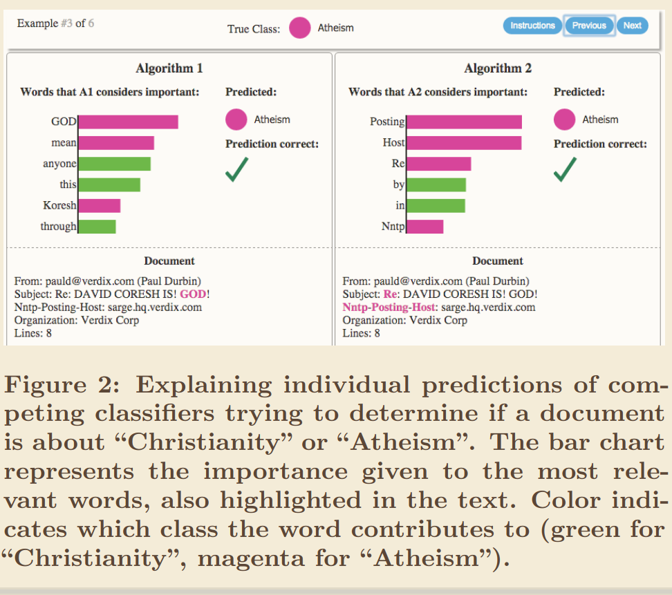

# Explainable AI (XAI)

Explanations were defined and characterised in [explanations](./explanation.md).

This post is an overview of the field of Explainable AI (XAI).

----------------

## Scope of the Field

Explainable AI (XAI) aims to explain machine and deep learning models inner workings and their outputs.

## Model Explainability

Let's start by taking "_model explainability_" apart. The suffix "-ability" means the "degree to which", so we have the "degree to which a model is explainable".

We want to _explain_ not only to the model's inner working but also to its outputs or predictions.

We have defined _explanation_ earlier, but we can roughly put all this together in one definition:

> [!NOTE]
> **Model explainability**
>
> The degree to which we can answer questions about a model's predictions and inner workings. The _answers_ are context and audience (including ourselves) dependent.

One similar paragraph from [Explaining Explanations in AI][xxai] defines explanation as:

> (...) "explanation" refers to numerous ways of exchanging information about a phenomenon, in this case the functionality of a model or the rationale and criteria for a decision, to different stakeholders (Lipton, 2016; Miller, 2017).

Four types of _model explainability_ are described in the following sections: Intrinsic, Extrinsic[^extr_intr], Local and Global.

> [!NOTE]
> In this blogpost, _explainability_ and _interpretability_ are considered synonyms.

### Global and Local Explanations

- Global: explains the full model e.g. by combining local explanations as in SP-LIME,
- Local: explains specific predictions or outputs of a model in connection to its input (e.g. LIME).

### Intrinsic Explainability

Intrinsic Explainability (or Transparency) looks at the internal mechanics, at the roles of layers, neurons, weights; it may also relate to constraining the model in form (e.g., [Rudin C.][stop_explaining_interpret_instead] or [Zachary C. Lipton][mythos]) &mdash;that is, imposing physical constraints, inductive biases, causal inputs selected by experts, monotonicity, sparsity, constraining model size or computational complexity. Or as Zachary C. puts it in [The Mythos of Model Interpretability][mythos]:

> Sufficiently high-dimensional [linear] models, unwieldy rule lists, and deep decision trees could all be considered less transparent than comparatively compact neural networks.

Furthermore, the paper suggests three components of _transparency_ (intrinsic explainability). Very briefly:

1. _Simulatability_ i.e. can mentally run the model,
2. _Decomposability_ i.e. each part of the model admits an intuitive explanation,
3. _Algorithmic training_ which focuses on global vs local minimum, error and loss, guaranteed convergence.;

Transparency is domain-dependent. For example, the field of geometric deep learning can express constraints (or inductive biases) of connectivity related to molecules and materials (e.g. GNNs), making them more interpretable than other network architectures for representing this particular input / physical problem. This can be further extended to symmetry and other aspects.

### Extrinsic Explainability

Extrinsic Explainability or post-hoc involves explaining prediction(s) rather than elucidating precisely how a model works.

<!-- Sometimes they use an extra _explanation model_, but not always. -->

["Why Should I Trust You?"][lime] defines "explaining a prediction" as:

> By "explaining a prediction", we mean presenting textual or visual artifacts that provide qualitative understanding of the relationship between the instance's components (e.g. words in text, patches in an image) and the model's prediction.

This is a visual explanation of the features' contribution to the output from the same paper, where it is used to compare models:

    
    
Image taken from <a href="https://dl.acm.org/doi/10.1145/2939672.2939778">paper</a>.

They also propose an _explainer desiderata_ for the explanation model: it should be `1.` **interpretable**, by giving a qualitative understanding between inputs and outputs, making it easy to understand, `2.` **model agnostic** and `3.` **locally faithful** (a good fit to the original model in the vicinity of the instance being explained) and `4.` **globally explainable**. In that paper, SP-LIME combines local explanations to provide a _global explanation_ of the model.

[Rudin][stop_explaining_interpret_instead] argues that these simpler explanation models must be wrong. If it is globally accurate, then we don't need the original model. Rudin proposes calling these model-approximation techniques "summary of predictions", "summary statistics" or "trends".

<!-- citing Box's maxim: "All models are wrong but some are useful" and -->
On the other hand, methods such as SHAP, LIME can provide _some_ understanding of the phenomena, often with local fidelity, even if approximately. [Explaining Explanations in AI][xxai] makes an analogy between local approximation and scientific models, they key part being that both may approximate a more detailed model within a narrow domain (in which they are valid).

They argue for the use contrastive explanations and the _original model_, which has less limitations of domain of validity and also curvature (non-linearity) and variable interdependency modelling.

Here is their pitch for it:

> Rather than explicitly generating a model that approximates functional values over a restrictive domain, and relying on the user to interpret this, contrastive explanations directly offer an alternative data point: "If your data had looked like this, you would have been given this classification score instead." These alternative data points can be computed exactly. As such, many of the challenges facing ’modelling’ approaches to generating explanations, such as the quality of the approximation or the limits of a chosen domain, do not arise to a comparable degree.

And the selection of the alternative data point is of high importance (must be relevant, and similar enough to background other causes). This is achieved by a particular Lagrange-style constrained optimisation which helps select that counterfactual (one that is both close to the data point of interest and to a certain desired output value).

<!-- The interest is usually around a particular prediction or a particular model (requiring a partial causal-rather than a full causal-chain). -->

Note also that local fitting of a prediction model may be faithful, but both models could be inaccurate. It's also not enough to have an interpretable model, as they continue:

> It is not enough to simply offer a human interpretable model as an explanation. For an individual to be able to trust such a model as an approximation, they must know over which domain a model is reliable and accurate, where it breaks down, and where its behaviour is uncertain. If the recipient of a local approximation does not understand its limitations, at best it is not comprehensible, and at worst misleading

That is, the domain where the models (both) are accurate, inaccurate or unknown should be characterised, and understood by the recipients.

- Couldn't we train local explainable models from scratch, and throw away the complex one? Usually no, _explanation models_ are trained with predictions of the complex model, that may not exist in the training data.

<!-- Some post-hoc XAI methods are explained in [strategies](./strategies.md). -->

### Post Hoc Methods

[Explaining Explanations in AI] states that:

> (...) first reviewing methods for producing explanations in xAI, and explain how they are generally more akin to scientific modelling than explanation giving.

Which is an important qualifier, they are more like a _toolkit to produce explanations_. They are also approximations and usually local in the sense of having a _domain of applicability_. Importantly, they are intelligible / interpretable as most scientific models are.

[The Mythos of Model Interpretability][mythos] and [Principles and practise of explaining ML models][principles_and_practice] name and review a few types of _post hoc interpretability_ (extrinsic explainability) techniques.

A similar version to those papers is given below:

- **Textual** e.g. using RNNs or a language model to translate the network state into text (trained with descriptions, similar to captioning images),
- **Similarity** (or Case-Based): Representative items for each class provide insights about the model's internal reasoning. Can be automated with distance KNNs but specific examples may require human selection.
    - They do not explicitly state what parts of the example influence the model. How do inputs from different classes compare? And same?
- **Visualizations**: of learned representations. Altering certain input features to maximise activation of a particular neuron (then looking back at the modified image to see what this neuron is responding to). Easier to communicate to non-technical audiences. Most approaches are intuitive and not hard to implement.
    - There is an upper bound on how many features can be considered at once. Humans must inspect plots to derive explanations. Class boundaries?
- **Contrastive Methods** look for similar cases that lead to a different decision, or that help clarifying the decision in some way.
They are a separate category because they may use the original model, and the key characteristic is the type of question they ask. But, as [Explaining Explanations in AI][xxai] says:
  > (...) choosing a relevant set of cases or events against which contrastive explanations are provided is not a straightforward challenge.
- **Approximations**: Simple, surrogate, interpretable models explain opaque ones, locally and/or globally. They also allow us to ask contrastive or what-if questions (see previous method) such as "What if we change X by X'?" Or "How could I get Y' rather than Y?" However, these approximation models are usually valid over a narrow domain, making many of these questions unfeasible.
    - [Explaining Explanations in AI][xxai] states:
  > These models can be understood as a "do it yourself kit" for explanations, allowing a practitioner to directly answer "what if questions" or generate contrastive explanations without external assistance.
    - **Feature relevance** can be considered a linear approximation model. They operate locally or globally (e.g. LIME and SP-LIME). These Methods may make assumptions which do not hold (e.g. feature independence, linearity).

A useful approach could be to use and compare several different these methods.

The last two classes are popular and often used in the context of **Local Explanations**, discussed in the [next post](./model_explainability_2.md).

----------------

Sources

1. [Can we open the black box of AI?][open_ai_black_box] (2016). This paper briefly explains what ANNs are, their similarities (not the differences) to the brain, and what challenges they pose to us. Primarily, the challenge is that they are hard to explain. It puts as an example a physician or patient relying in the output, but not knowing _why_ it predicts that. The author also cites Michael Tyka saying "The problem is that the knowledge gets baked into the network, rather than into us" which is also interesting.
Furthermore, there isn't a "number 5 pattern" that is the same for many networks; the pattern appears from the training procedure, and although it may be similar for all number 5, it's usually different between training runs, datasets, and networks. Similarly so for brains!
1. ["Why Should I Trust You?": Explaining the Predictions of Any Classifier][lime] (2016)
1. [The Mythos of Model Interpretability][mythos] (2018) is an excellent break down of ideas. This paper is cited and discussed in the post primarily.
1. [A Unified Approach to Interpreting Model Predictions][shap_values] (2017): paper proposing SHAP, that is, showing Shapley values as the best coefficients in linear combination of features, given 3 requirements (local accuracy, missingness and consistency),
1. [Explaining Explanations: An Overview of Interpretability of Machine Learning][xx] (2018),
1. [Producing radiologist-quality reports for interpretable artificial intelligence][xai_rnn_radiology] (2018): a "case study",
1. [The Book of Why][tbow] (2018): The introduction and first chapter were read in detail, only the part of interest for XAI (to my judgement) is discussed here, comparison and counterfactuals. It's interesting but may be more useful in other areas (like medical sciences, economics etc.)
1. [Explaining Explanations in AI][xxai] (2019). **First** it review post hoc methods and makes an analogy of XAI post-hoc methods to scientific models (i.e. they are local interpretable approximations and help _generate_ explanations). **Then** answering "why-questions" requires "contrastive, selective and social" explanations. **Finally**, that an interactive, dialectic way to challenge algorithmic decisions is needed. It distinguishes "scientific explanations" addressing general phenomena with a full causal chain from "everyday explanations" addressing particular facts with partial causal chains.
1. [Stop Explaining Black Box Machine Learning Models for High Stakes Decisions and Use Interpretable Models Instead][stop_explaining_interpret_instead] (2019).
   - Suggests post-hoc models are worse than interpretable/transparent ones for high-stakes scenarios. It also states that the definitions of "Interpretable" varies for each field (references removed):
   > Interpretability is a domain-specific notion, so there cannot be an all-purpose definition. Usually, however, an interpretable machine learning model is constrained in model form so that it is either useful to someone, or obeys structural knowledge of the domain, such as monotonicity, causality, structural (generative) constraints, additivity, or physical constraints that come from domain knowledge. Interpretable models could use case-based reasoning for complex domains.
   - The paper also **challenges the beliefs** that `1.` There is a trade-off between interpretability and accuracy; also that `2.` Explanation models (e.g. SHAP, LIME) provide faithful explanations of black-box models (and that a better term to "explanations" is "summary statistics" or "trend"), finally that `3.` The explanations are detailed enough (Saliency Maps) and so forth.
   - And describes challenges towards Interpretable AI: `1.` Black boxes shields companies from accountability (incentives); `2.` Interpretable models are harder to construct (require more expertise). `3.` Belief DL models can uncover patterns that interpretable models wouldn't find (the issue is the belief).

1. [The perils and pitfalls of explainable AI: Strategies for explaining algorithmic decision-making][perils_and_pitfalls] (2021): emphasis on socio-political aspects,
1. [Why black box machine learning should be avoided for high-stakes decisions, in brief][interpretable_ml] (2022),
1. [Interpretable and Explainable Machine Learning for Materials Science and Chemistry][xai4mat] (2022),
1. [Principles and practice of explainable machine-learning][principles_and_practice] (2021, 25 pages): Sections 8&ndash;11 are a useful review of explainability methods.
1. [Scientific discovery in the age of artificial intelligence][ai_aided_discovery] (2023).
1. [A Perspective on Explainable Artificial Intelligence Methods: SHAP and LIME][using_shap_lime] (2024).

<!-- Also, a very interesting experiment in terms of explainability was <https://distill.pub>. -->
[ai_aided_discovery]: https://www.nature.com/articles/s41586-023-06221-2

[interpretable_ml]: https://www.nature.com/articles/s43586-022-00172-0

[lime]: https://dl.acm.org/doi/10.1145/2939672.2939778

[mythos]: https://dl.acm.org/doi/10.1145/3236386.3241340

[open_ai_black_box]: http://www.nature.com/news/can-we-open-the-black-box-of-ai-1.20731

[perils_and_pitfalls]: https://doi.org/10.1016/j.giq.2021.101666

[principles_and_practice]: https://www.frontiersin.org/journals/big-data/articles/10.3389/fdata.2021.688969/full

[shap_values]: https://proceedings.neurips.cc/paper/2017/hash/8a20a8621978632d76c43dfd28b67767-Abstract.html

[stop_explaining_interpret_instead]: http://arxiv.org/abs/1811.10154

[tbow]: https://en.wikipedia.org/wiki/The_Book_of_Why

[using_shap_lime]: https://onlinelibrary.wiley.com/doi/abs/10.1002/aisy.202400304

[xai_rnn_radiology]: https://arxiv.org/abs/1806.00340

[xai4mat]: https://pubs.acs.org/doi/10.1021/accountsmr.1c00244

[xx]: http://arxiv.org/abs/1806.00069

[xxai]: https://dl.acm.org/doi/10.1145/3287560.3287574

[^extr_intr]: Intrinsic explainability is also called "Transparency", "Inherently interpretable models"; Extrinsic explainability is also called "black boxedness", post-hoc explainability, opaqueness.

<!-- The latter paper reminds us that: -->
<!---->
<!-- > Relying on only one technique will only give us a partial picture of the whole story, possibly missing out important information. Hence, combining multiple approaches together provides for a more cautious way to explain a model. (...) At this point we would like to note that there is no established way of combining techniques (in a pipeline fashion), -->
<!---->
<!-- Some methods may need to be adapted for a given audience. -->
<!---->
<!-- Often, in XAI the explanation is often generated by interaction between an inquirer such as the user or developer, and the explanation model ([Explaining Explanations in AI][xxai], **4.3**). -->
<!-- This is a model of a model, or a model derived from a model, which is a difference in the analogy. Though we could also consider this as an emergent model, derived from a more detailed one (just as averaging in statistical thermodynamics to get larger scale laws). -->
<!-- Higher level models approximate lower level ones. Analogously, the _explanation model_ approximates the more complex _prediction model_. -->

<!-- > Although any physical system can be understood in terms of the emergent properties of subatomic particles, such descriptions are neither human comprehensible nor computationally feasible. Instead, scientists deal in local approximations that provide accurate descriptions of the phenomena they are interested in, but which may prove inaccurate in a larger domain. -->
<!---->
<!-- They also define scientific modelling: -->
<!---->
<!-- > scientific models, which can be understood as partial causal scientific explanations that assist in comprehending a piece of the functionality of a phenomenon (Ruben, 2004). -->

<!--  they could help explain a model as well. -->
<!-- As [Explaining Explanations in AI][xxai] states: -->
<!---->
<!-- > (...) the fact that contrastive explanations address a particular event or case and are thus simpler to generate than complete or global explanations of model functionality suggest they worth further consideration in xAI (Lipton, 1990). -->
