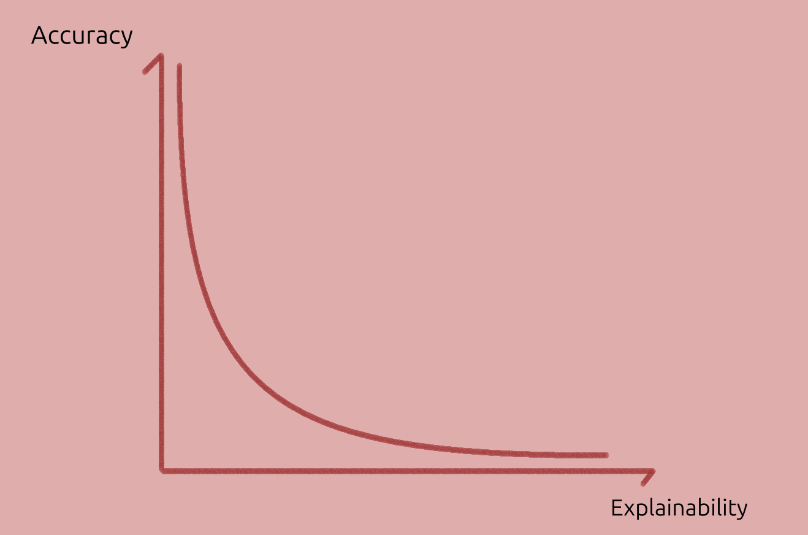
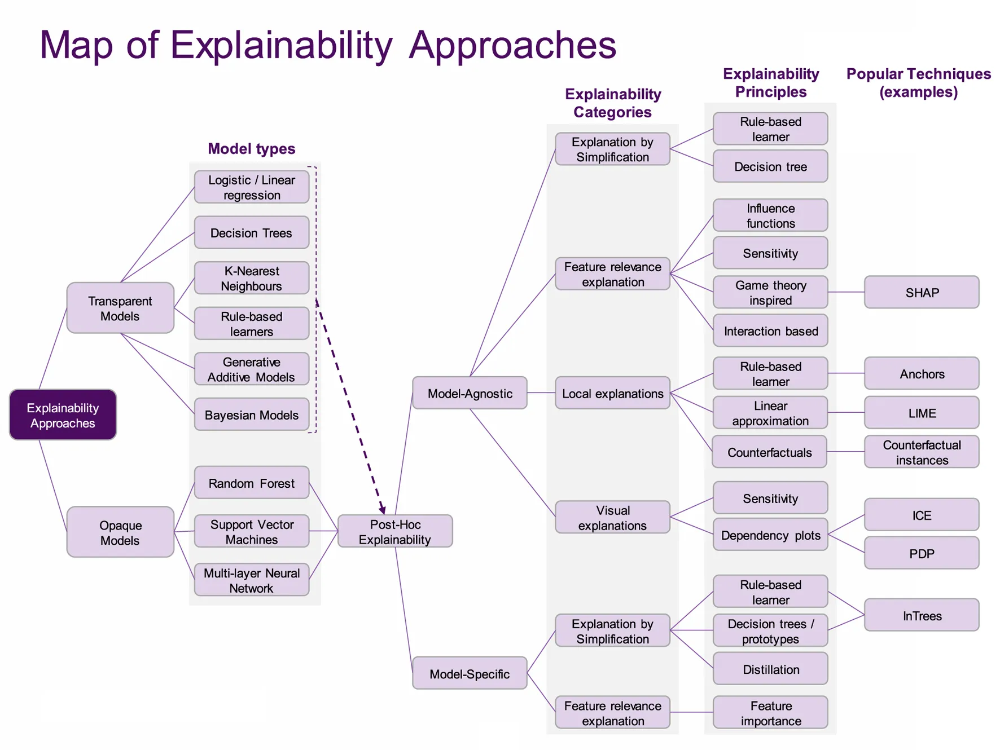

# Topics in XAI

Let's now discuss three key topics which stand on their own:

- Local and Counterfatctual explanations which are popular post-hoc explainability classes,
- Modelling trade-offs,
- Generalisation out of distribution.

Finally, an interesting map of XAI extracted from one paper is shown.

----------------------

## Local Explanations

These models can be understood as a "do it yourself kit" for explanations, allowing a practitioner to directly answer "what if questions" or generate contrastive explanations without external assistance.

Linear, gradient-based and decision trees are used to explain particular predictions, as local explanation models. They can be extended to be global (as we will discuss).

Local explanation models can be defined as simpler and interpretable models used to approximate and explain particular predictions of the original model.

[Explaining Explanations in AI][xxai] adds:

> Explainable AI generates approximate simple models and calls them 'explanations', suggesting reliable knowledge of how a complex model functions.

To my interpretation, the paper also argues that this isn't an explanation in itself. Rather, they are models we can use to generate local explanations.

It must still be complemented by the areas where the model is accurate, breaks down, or its fit to the prediction model is unknown. And where the explanation model is accurate, they say:

> Over the domain for which the model accurately maps onto the phenomena we are interested in, it can be used to answer 'what if' questions, for example "What would the outcome be if the data looked like this instead?" and to search for contrastive explanations, for example "How could I alter the data to get outcome X?"

Connecting this post with the [one on explanations](./explanation.md), particularly _contrastive_ ones.

These models operates on instance-level explanations. Explanations do not generalize on a global scale, unless something else is done (e.g. SP-LIME, explained in this post).

Hence, contrastive explanations may only be possible for neighbouring points, where the local explanation models are accurate, but restricting its usefulness. They also fail to model highly non-linear models (property of curvature) and interdependency between variables.

Besides models like SHAP and LIME which fit a simpler model, local explanations can be provided by instance gradients (saliency maps,$\frac{y_j}/{\mathbf{x}}$), fitting simpler local models (e.g. Linear LIME). In this case small perturbations might result in very different explanations.

## Trade-offs?

We may expect _model explainability_ to be inversely correlated with model complexity or accuracy. Graphically:

    
    
Hypothesis: Model explainability v. Accuracy tradeoff.

And in ["Why Should I Trust You?"][lime] (refs removed):

> Recognizing the utility of explanations in assessing trust, many have proposed using interpretable models, especially for the medical domain. While such models may be appropriate for some domains, they may not apply equally well to others (...). Interpretability, in these cases, comes at the cost of flexibility, accuracy, or efficiency.

And in [SHAP][shap]:

> However, the highest accuracy for large modern datasets is often achieved by complex models that even experts struggle to interpret, such as ensemble or deep learning models, creating a tension between accuracy and interpretability.

And in [Explaining Explanations in AI][xxai]:

> (...) three-way trade-off between the simplicity of the approximated model, the size of the domain it describes, and the accuracy of this description.

And also:

> A trade-off inherently occurs between the insightfulness of the approximated model, the simplicity of the presented function, and the size of the domain to which is applies and remains valid (Bastani et al., 2017; Lakkaraju et al., 2017).

Other researchers such as [Rudin][interpretable_ml] disagree (references were removed, and bold is mine):

> Two obstacles to using interpretable models are that they are harder to optimize because they require extra constraints, and there is an incorrect perception that they are less accurate than black boxes. On the first point, the community is getting quite good at building interpretable sparse models and interpretable neural networks. On the second point, there is no scientific evidence that accuracy must be sacrificed when adding interpretability constraints.

Rudin's [more detailed paper][stop_explaining_interpret_instead] restates the first point:

> There is a widespread belief that more complex models are more accurate, meaning that a complicated black box is necessary for top predictive performance. However, this is often not true, particularly when the data are structured, with a good representation in terms of naturally meaningful features.

And the second point:

> The researcher needs to create a model that has the capability of uncovering the types of patterns that the user would find interpretable, but also the model needs to be flexible enough to fit the data accurately. This, and the optimization challenges discussed above, are where the difficulty lies with constructing interpretable models.

So there is the:

- _Problem of optimisation_ (under constraints) and
- The _problem of designing_ such transparent models (including neural networks), which require expertise, while black boxes may not,
    - We should add that black boxes have plenty of issues with accountability, reliability, accuracy, and value of the explanations.
- There is also the problem of input representation, that is of finding or creating a _good representation in terms of naturally meaningful features_.

But in terms of the trade-off there is no clear scientific evidence that interpretable models are less accurate, though they can be harder to design and optimise.

Within the class of NNs though, they do tend to perform better as we scale them up until eventually plateau or decrease its performance. But there doesn't seem to be any cross-algorithm evidence or formal argument of the complexity-accuracy tradeoff.

Rudin also considers the Rashomon set argument: if there are several models with similar high-accuracy, then there may also be some within the set that are interpretable.

An interesting, related question is: is the three-way trade-off of domain of applicability, ease of understanding and accuracy also valid in general, for any model? This may still support Rashomon sets, but the ease of understanding may be quite low (requiring very high expertise). But here we can ask the question more generally about models.

## Counterfactual Explanations in AI

"[Counterfactual explanations without opening the black box][without_opening_bbox]" defines these explanations as the minimum change in the input (in some distance metric) to change the output (or keep it the same depending on the goal).

In other words, counterfactual explanations are contrastive in the sense that they compare two situations, and non-causal, unless the use a causal model.

[Explaining Explanations in AI][xxai] argues for the use contrastive explanations for the _original model_, which has less limitations than linear, local explanations[^linear_limitations]:

> Rather than explicitly generating a model that approximates functional values over a restrictive domain, and relying on the user to interpret this, contrastive explanations directly offer an alternative data point: "If your data had looked like this, you would have been given this classification score instead." These alternative data points can be computed exactly. As such, many of the challenges facing 'modelling' approaches to generating explanations, such as the quality of the approximation or the limits of a chosen domain, do not arise to a comparable degree.

And the selection of the alternative data point is of high importance (must be relevant, and similar enough to background other causes). This is achieved by a particular Lagrange-style constrained optimisation which helps select that counterfactual (one that is both close to the data point of interest and to a certain desired output value).

As an example, they use:

$$\mathrm{argmin}_{x'} \mathrm{argmax}_{\lambda} \lambda (f(x')-y)^2 + d(x,x')$$

with an $L_1$ norm (absolute distance between the given $x$ a close value to find, which is $x'$). The important part here is that the $L_1$ norm can usually find a resulting vector that contains several zeros ($x'=x$ for many features), this makes counterfactuals easier to explain (less differences).

- There may also be local minima, which can all be provided as a cluster of explanations to look at,
- $x'$ must also be a "possible world" or possible point,
- This optimisation is harder if variables are discrete (assumed continuous here).

Their other paper [Counterfactual Explanations without Opening the Black Box: Automated Decisions and the GDPR][without_opening_bbox] states why and for whom these explanations may be most useful:

> Principally, counterfactuals bypass the substantial challenge of explaining the internal workings of complex machine learning systems.70 Even if technically feasible, such explanations may be of little practical value to data subjects. In contrast, counterfactuals provide information to the data subject that is both easily digestible and practically useful for understanding the reasons for a decision, challenging them, and altering future behaviour for a better result.

Counterfactual explanations explain automated decisions (partly or fully), don't require opening the black box (explaining inner workings) and are easier to generate and to understand as well than the internals of the model. Not disclosing the model protects companies' trade secret and (as they state) "the privacy of individuals whose data is contained in the training dataset (...) Assuming reasonable limitations are set on the number of counterfactuals that must be provided, counterfactuals are also less likely to provide information that reveals trade secrets or allows gaming of decision-making systems."

### Advantage of counterfactual over simpler model

Note also that local fitting of a prediction model may be faithful, but both models could be inaccurate. It's also not enough to have an interpretable model, as they continue:

> It is not enough to simply offer a human interpretable model as an explanation. For an individual to be able to trust such a model as an approximation, they must know over which domain a model is reliable and accurate, where it breaks down, and where its behaviour is uncertain. If the recipient of a local approximation does not understand its limitations, at best it is not comprehensible, and at worst misleading

That is, the domain where the models (both) are accurate, inaccurate or unknown should be characterised, and understood by the recipients.

- Couldn't we train local explainable models from scratch, and throw away the complex one? Usually no, _explanation models_ are trained with predictions of the complex model, that may not exist in the training data.

### When are counterfactual explanations insufficient?

The authors note that their counterfactual explanations don't require causal graphs or causal models, which in some cases can be needed.

Also, as they state:

> As a minimal form of explanation, counterfactuals are not appropriate in all scenarios. In particular, where it is important to understand system functionality, or the rationale of an automated decision, counterfactuals may be insufficient in themselves. Further, counterfactuals do not provide the statistical evidence needed to assess algorithms for fairness or racial bias. Given these limitations, more general forms of explanations and interpretability should still be pursued to increase accountability and better validate the fairness and functionality of systems.

## Out of Distribution

Consider an imaginary model $y = f(u)$, $f$ being the model, $u$ being the proportion of people with an umbrella and $y$ the probability of rain. The model reaches low evaluation error and everyone is happy.

However, the model consistently fails to predict rains when people didn't take the umbrella. Why could this happen? Some of the reasons below were inspired by the paper "[The Mythos of Model Interpretability][mythos]":

1. The model _undefitted_ the data, and we may need a better model.
1. The dataset is _not representative_ the deployment environment, and the model can't generalise out of training distribution. Can it be fixed if we don't have those datapoints? Were there simply wrong datapoints, that led the model in the wrong direction? Can we create synthetic data?
1. The approach itself was incorrect: we use variables that promote _association rather than causation_.

Selecting possible causal variables, such as pressure and temperature, rather than the fraction of humans carrying out an umbrella, could help to make it more accurate, and even more explainable. But does it have _all_ the _causal inputs_? Why do we expect it to work out of distribution, though?[^selection_problem]

A subset of causal-variables may do for a good-enough approximation, and even generale well out of distribution. In some cases though, it may be enough to have a correlation model, but they should be distinguished.

Selecting those variables is not very easy, though. An expert must pick known causes-effects pairs as inputs-outputs to train a model, but others may unknowingly build a correlation model instead.

> It is hard to predict whether a model will work out of distribution without knowing what it has learnt. Knowing what a model has learnt is part of the XAI discipline, both opening the box, or carefully comparing its outputs.

Similarly, [this two-page comment][interpretable_ml] by Cynthia Rudin highlights the preference for interpretable (transparent) models in high stakes scenarios.

In Deep Learning Models, the problem constraints can be used to add inductive biases or priors to architectures, such as symmetry constraints, connectivity (say through graph networks). This may also reduce the amount of training data needed, improve generalisation and improve interpretability.

An idea related to "Out Of Distribution" inference is that of "Transfer Learning": If a model has learnt "essential, compact features" then they should generalise to other task, as stated in [Scientific discovery in the age of artificial intelligence][ai_aided_discovery] (references where removed):

> Self-supervised learning (Box 1) has enabled neural networks trained on labelled or unlabelled data to transfer learned representations to a different domain with few labelled examples, for example, by pre-training large foundation models and adapting them to solve diverse tasks across different domains.

This is especially useful when models can leverage large amount of data, which is usually in the form of unlabelled data (there are also mechanisms to label data semi-reliably).

Another promising path towards better generalisation is that of Causal AI. As ["Scientific discovery in the age of artificial intelligence"][ai_aided_discovery] puts it:

> Although many scientific laws are not universal, their applicability is generally broad. Compared with state-of-the-art AI, human brains can better and faster generalize to modified settings. An attractive hypothesis is that this is because humans build not just a statistical model of what they observe but a causal model, that is, a family of statistical models indexed by all possible interventions (for example, different initial states, actions of agents or different regimes). Incorporating causality in AI is still a young field

## Map of XAI

An interesting map of XAI is given in the survey [Principles and practice of explainable ML][principles_and_practice] (2021).

Most _classic ML_ models are in the dashed area under **Model types** column.

_Classic ML_ models are usually _transparent_ (intrinsically explainable) but _may_ benefit from post-hoc (post training) explanations, such as visualising it. When transparency is key and the predictions are accurate enough, these may be preferred over DL models.

    
    

    Image from <a href="https://www.frontiersin.org/journals/big-data/articles/10.3389/fdata.2021.688969/full">paper</a> under <a href="https://creativecommons.org/licenses/by/4.0/">CC-BY</a>
    

To the visual explanations, t-SNE, PCA and other dimensionality reduction techniques can be added.

The focus here though, is explaining _deep learning_ models which are often, but not always, more accurate than classic ML models.

[ai_aided_discovery]: https://www.nature.com/articles/s41586-023-06221-2
[lime]: https://dl.acm.org/doi/10.1145/2939672.2939778
[mythos]: https://dl.acm.org/doi/10.1145/3236386.3241340
[principles_and_practice]: https://www.frontiersin.org/journals/big-data/articles/10.3389/fdata.2021.688969/full
[stop_explaining_interpret_instead]: http://arxiv.org/abs/1811.10154
[xxai]: https://dl.acm.org/doi/10.1145/3287560.3287574

[^linear_limitations]: Only valid for a small region, can't fit curvature / non-linearity, struggles with variable interdependency modelling.
[^selection_problem]: Could metaphors and analogies (from experience) be the missing ingredient of this to succeed? Could using causal models help to overcome these problems? How can we make a model that uses analogies?
