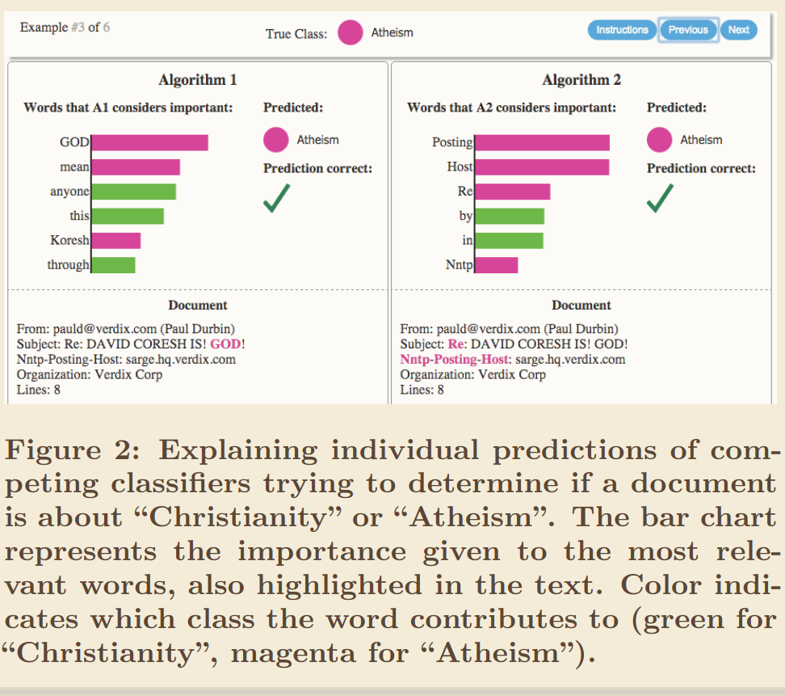

# Additive Feature Attribution Methods

<!-- In previous posts, we have described explanations and proposed a definition of _model explainability_. Here the definitions are those that each paper uses, rather than the general ones given in these series. -->

These set of methods are linear approximations ($g$) to the original model ($f$). Mathematically:

$$f(x) \approx g(z) = \phi_0 + \sum_{i=1} \phi_i z_i$$

$\phi_i$s are the effect of each _binary_ feature $z_i$ in the output. Clarifications:

1. Two complex models $f_1$, $f_2$ trained with same data likely have different coefficients for each approximation model ($\phi_i$s),
1. Methods don't protect from a biased model.

_Note_: these could be called linear combination of binary features as well.

## Best coefficients?

Existing additive feature methods (e.g. SHAP, LIME) calculate $\phi_i$s differently, in turn yielding different coefficients. But...which one obtains the _best_ coefficients $\phi_i$? A definition of _best_ is needed.

The [Unified Approach to Interpret Model Predictions][unified_approach_lcobf] proposes that models should have _local accuracy_, _missingness_, _consistency_. With these requirements, they show that Shapley values are the best coefficients. Other methods violate some of these 3 properties.

The authors argue these properties lead to coefficients that are more intuitive for humans.

## Method: SHAP

SHAP stands for SHapley Additive exPlanations, it is considered a feature attribution method rather than a simplification method. The [Principles and practice of explaining ML][principles_and_practice] states:

> The objective in this case is to build a linear model around the instance to be explained, and then interpret each features' coefficient as the features' importance. This idea is similar to LIME, in fact LIME and SHAP are closely related, but SHAP comes with a set of nice theoretical properties.

The exact Shapley values $\phi_i$ result from an expensive combinatorial (see sources at the end). Approximations to the exact formula can be made, with extra assumptions, which **may not hold**:

Assumption 1: Feature independence (implies non-multicollinearity).

- Shapley sampling values method,
- Quantitative Input Influence,
- Plus assumption 2, model linearity: Kernel SHAP (LIME + Shapley values)

Assumption 2, model linearity: Shapley regression values.

SHAP provides both global (average across inputs) and local (for a given input).

## LIME

The [Local Interpretable Model-Agnostic eXplanation][lime] (LIME) aims to explain _a particular prediction_ of a black-box model with an _interpretable model_ that uses an _interpretable representation_ of the input. Let's now clarify some of terms these terms.

- _Local_: the explanation model approximates the original model around a particular prediction (local to it). This in contrast with _global_ explanations, which explain the full model.

- _Model-agnostic_: any black-box model can in principle be explained by this method.

Now the most complicated parts. "Interpretable" and "Explanation".

"Interpretable" is a desired characteristic of "Explanation". In their own words:

> An essential criterion for explanations is that they must be interpretable, i.e., provide qualitative understanding between the input variables and the response. We note that interpretability must take into account the user's limitations.

They also propose a complexity metric because even those simpler models can become hard to interpret (they call this fidelity-interpretability tradeoff). So the desired characteristics of explanation-models hinted above are:

- Interpretable, with interpretable input representations,
    - An example is shown [in this section](#interpretability-in-LIME).
- Model-agnostic (described earlier),
- Locally faithful (perfect global-faithfullness would be the same model).
- Global Perspective.

<!-- ### LIME: Two Explanatory Levels -->
<!---->
<!-- <!-- The paper describes two explanatory levels; they also map to _trust_ levels: an explanation increases understanding which in turn calibrates our trust. --> -->
<!---->
<!-- - _Explaining / Trusting a prediction_: Does the user trust the prediction to take an action based on it? For that, the user needs to develop an intuitive understanding of which features contribute most to the model's output. Also, the explanation model must be faithful and simple. -->
<!---->
<!-- - _Explain / Trusting the whole model_: Does it perform well on real-world data? For the right reasons? Explanations from representative inputs may be aggregated to (global explanation), beyond just particular predictions. The method used for this purpose is called SP-LIME. This is used alongside evaluation accuracy and other metrics. -->
<!---->
<!-- Both explanations boil down to understanding predictions. -->

The downstream benefits of the kind of explanations they propose (LIME, SP-LIME) are:

- Provide understanding of predictions,
- Help domain-experts decide whether and why to accept (or reject) a prediction,
- Help selecting a competing model,
- Suggest how to improve a model (e.g. that which uses relevant features).

### Interpretability in LIME

As previously mentioned, an key aspect of an explanation model is **interpretability** which implies qualitative understanding.

Which representations does the [LIME][lime] paper consider interpretable?

An _interpretable representation_ may use a binary vector indicating presence / absence of a word in the explanation model, replacing an embedding in the original model.

Which models does the [LIME][lime] paper consider interpretable?

> (...) interpretable models, such as linear models, decision trees, or falling rule lists [27], i.e. a model g ∈ G can be readily presented to the user with visual or textual artifacts.

Here is an example of a visual explanation from the [original paper][lime], comparing two models' predictions using LIME to show the influence of each input feature in the output:

    
    
Image taken from <a href="https://dl.acm.org/doi/10.1145/2939672.2939778">paper</a>.

### LIME: The Algorithm

The paper uses a sparse linear model as explanation model. Here is my interpretation of the algorithm:

1. A model $f$ and an input vector $x \in R^n$ needs explaining,
2. Start an interpretable, binary vector $x' \in {0,1}^{n'}$ with only the dimensions of interest of $x$ (it may be all-ones often),
3. Generate perturbed binary variants of $x'$ called $z'$,
4. Use $z'$ to make variants of $x$ called $z \in R^n$,
5. Now we have training tuples $(f(z), z', \pi_{x} (z))$.

The interpretable representation is a binary vector that may use a subset of the original features (even transformed ones). This combination is easier to understand while staying close to the original model _around a prediction_ (locally faithful).

### LIME: Summary

In a nutshell, the paper proposes to approximate a complex model around a prediction with a simpler (explanation) model that we can understand conceptually.

This is to be used as a complement (not a replacement) to accuracy or other evaluation metrics.

Lastly, the input representation must also be conceptually meaningful.

## Fixes

- Normalised Moving Rate (NMR): tests the stability of the list against the collinearity. Smaller NMR means more stable ordering.
- Modified Index Position, in the [paper's words][using_shap_lime]:
  > [MIP] works similarly to NMR by iteratively removing the top feature and retraining and testing the model. Thereafter, it examines how the features are reordered in the model which implies the effect of collinearity.

These two methods (MIP, NMR) can be useful both in having a reliable sorting of features, and on selecting one &mdash;most stable&mdash; of several methods.

## Definition of a few concepts

Aside: Collinearity and Non-linearity

**Multicollinearity**: one feature is a linear combination of one or more other features. For example, $x_3 = \beta_2 x_2 + \beta_1 x_1 + \beta_0$; assuming linear independence would be an error. In the [paper's words][using_shap_lime]:

> Indeed, some features might be assigned a low score despite being significantly associated with the outcome. This is because they do not improve the model performance due to their collinearity with other features whose impact has already been accounted for.

**Non-linearity**: output changes are not proportional to input changes. For example $y = \beta x^N$ is non-linear, and fitting a line $y' = \alpha x$ to it would be inaccurate. Some SHAP models can model this correctly.

Let's now look at other methods.

Sources

1. [A value for n-person games][shap original] (1952)
1. ["Why Should I Trust You?": Explaining the Predictions of Any Classifier][lime] (2016)
1. [A Unified Approach to Interpreting Model Predictions][unified_approach_lcobf] (2017)
1. [Principles and practice of explainable machine-learning][principles_and_practices] (2021, 25 pages): overview of many aspects of XAI,
1. [A Perspective on Explainable Artificial Intelligence Methods: SHAP and LIME][using_shap_lime] (2025): conceptual aspects (weaknesses, strengths, assumptions) of the popular XAI methods SHAP and LIME.

[lime]: https://dl.acm.org/doi/10.1145/2939672.2939778
[principles_and_practice]: https://www.frontiersin.org/journals/big-data/articles/10.3389/fdata.2021.688969/full
[using_shap_lime]: https://onlinelibrary.wiley.com/doi/abs/10.1002/aisy.202400304
[unified_approach_lcobf]: https://proceedings.neurips.cc/paper/2017/hash/8a20a8621978632d76c43dfd28b67767-Abstract.html
[shap original]: https://sites.math.rutgers.edu/~zeilberg/EM22/Shapley1952.pdf
