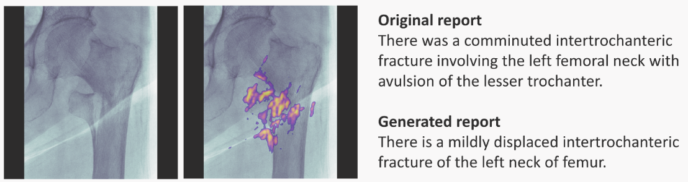

# Explainable AI - Methods II

## Other Explainability Methods

- **Saliency Maps**: visually show which features are most important in a particular prediction. They can be generated for 1D, 2D and ND inputs. For example, here is for radiology:
    

        
        
<strong>Left-most</strong>: input image; <strong>next</strong>: input + saliency map; <strong>right-most</strong>: doctor's annotation (top) and RNN-model generated annotation (bottom). Image taken from <a href="https://arxiv.org/abs/1806.00340">paper</a>.

    

- **Validity Interval Analysis**: another technique fitting the NN behaviour to try to extract explanations.
- **Dimensionality Reduction**: Principal Component Analysis, t-SNE, Dimensionality Reduction, Independent Component Analysis, Non-negative Matrix Factorisation can all help as well.

## Explanation-producing Architectures

Architectures designed to make explaining part of their operation easier.

- Using Explicit Attention: An attention layer/mask learns how parts of an input embedding pay attention to other parts. The layer is somewhat interpretable. In chemistry, it could learn which atoms connect (or pay attention to) other atoms.

- Dissentangled Representations: <q>Disentangled representations have individual dimensions that describe meaningful and independent factors of variation.</q> &mdash;[Explaining Explainability][XX] (2018). Examples of architectures are $\beta$-VAE, INFOGan, capsule networks.

[XX]: http://arxiv.org/abs/1806.00069
