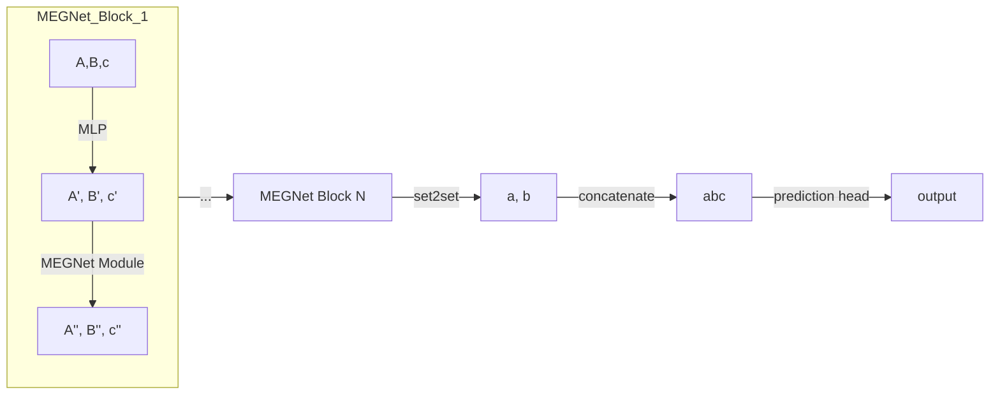

# Graph Networks for Chemistry

[Materials Graph Network][gn] (MEGNet) was introduced in 2018 by Shyue Ping Ong et al. based on the work in Graph Networks by Battaglia et al.

The network is for property prediction, so we need property-values for training it, and the graph structures as inputs.

Graph Networks are a generalisation over graph-based neural networks (such as Message Passing and Crystal-Graph Neural Nets) because they are _not_ constrained to use Neural Networks to update the object's graph.

A note on paper terminology: "materials" encompasses molecules and crystals.

## MEGNet

The novel part of MEGNets are the MEGNet modules, and the addition of a global state vector.

### MEGNet Modules

The MEGNet modules map the attribute-vectors for each object in the graph: $(A, B, c)\mapto{}_{Graph Module}(A', B', c')$. Where $A$ are atom vectors (vertices in the graph) and $B$ bond vectors (edges) of the material and $c$ is a global state vector, or context.

The mapping is done serially, in the following way (using `+` as concatenation of vectors):

1. Update bond vector $\mathbf{b'}_{12} = \phi_b(\mathbf{b}+\mathbf{a}_1+mathbf{a}_2+\mathbf{u})$
   - Information flows from atoms to bonds
2. Update atom vectors using average bond vector $\mathbf{a'}_1 = \phi_a(\mathbf{a}_1+\overline{\mathbf{b}_{1k}}+\mathbf{u})$
   - Information flows from bonds (as average) to atoms.
3. Update global vector using average bond and atom vector $\mathbf{u'} = \phi_a(\overline{\mathbf{a}}+ \overline{\mathbf{b}_{ik}}+\mathbf{u})$
   - Information flows from average of atom and bond vectors to the global state.

A _reduce operation_ is applied through _set2set(A)_, _set2set(B)_, to obtain a single atom vector and a single bond vector. These two vectors are then concatenated along with a global vector (see below), into a single vector.

The resulting vector can be used (and reused, through transfer-learning) in prediction heads.

### MEGNet Blocks

The blocks consist of the MEGNet module preceded by a 2-layer perceptron.

The whole network can be described (in very simplified terms) as:

## Datasets

What we need here is the vertices and edges vectors (materials' graph structures), and the property we want to train it for.

- For molecules they selected QM9, which is a dataset of DFT calculated energies for small molecules; they used version preprocessed by other authors.

- For crystals, they obtained properties and structures from the materials' project API.

They timestamped the database used, published the datasets as JSON for reproducibility, and published the code on GitHub.

Sources

1. [Graph Networks as a Universal Machine Learning Framework for Molecules and Crystals][gn] (2019)

[gn]: http://arxiv.org/abs/1812.05055
