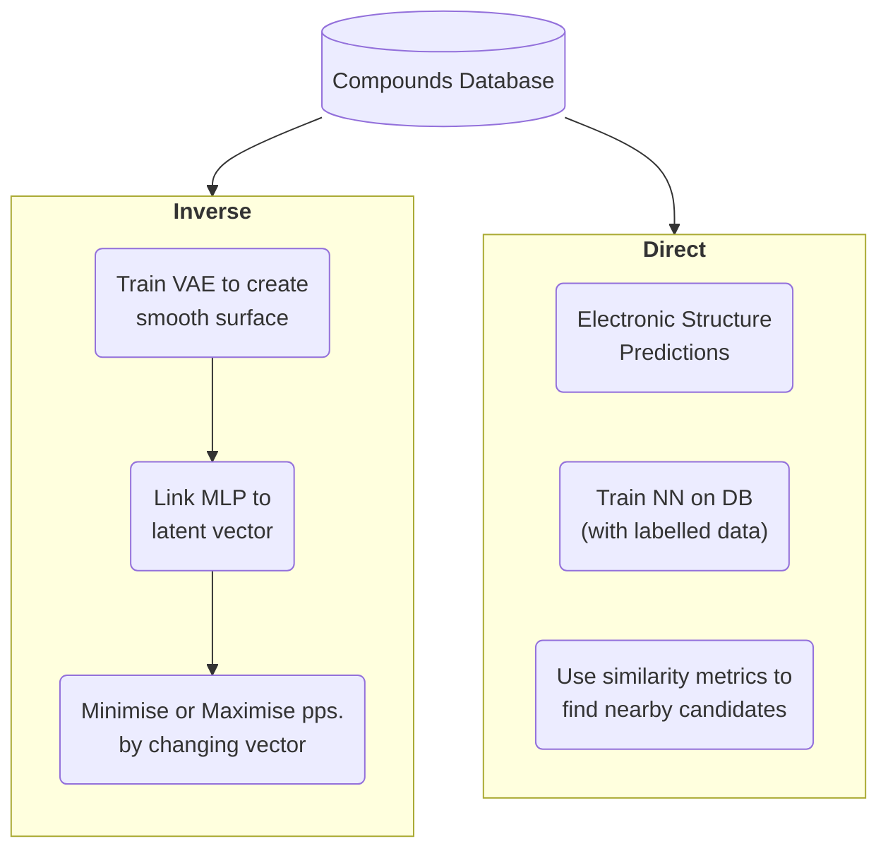

# CompChem Map

This is a draft of areas I'd like to organise in some taxonomy.

## Finding Useful Molecules

- Get a Materials Database(s), either method

### Method 1: Direct (Compounds to Properties)

- Use DFT to guide towards one that fits the requirements (slow if we have billions of compounds.),
- _Or_ use the DB to train a NN to make predictions (needs labelled data for training)
- _Or_ similarity metrics to find new (similar) molecules.
- ...

### Method 2: Inverse (Properties to Compounds)

1. Use the gradient to update embedding.
2. Maximise or Minimise the needed properties.

The paper's approach is more towards a **Direct** method. It is a method to generate embeddings that can then be used to train a neural network to predict properties.

This can be arranged (not very tidily) in a chart:

## Unsupervised-Learning of Representations of Atoms

Other investigations of unsupervised learning of machine representation of atoms are:

- Zhou, Q. et al. Learning atoms for materials discovery. (2018).
- Tshitoyan, V. et al. Unsupervised word embeddings capture latent knowledge from materials science literature. (2019).
- Chakravarti, S. K. Distributed representation of chemical fragments. (2018).
- Butler K. et al. Distributed Representations of Atoms and Materials for Machine Learning. (2022).

## Supervised-Learning of Representations of Atoms

- Jha, D. et al. ElemNet: deep learning the chemistry of materials from only elemental composition. (2018).
- Goodall, R. E. & Lee, A. A. Predicting materials properties without crystal structure: deep representation learning from stoichiometry. (2020).
