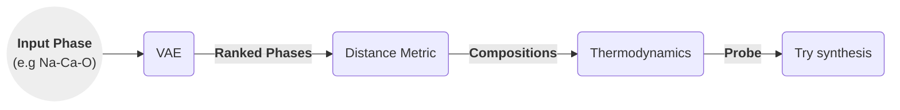

# Discovering Inorganic Solids

These are some of my opinions and ideas after reading [Discovery of Crystalline Inorganic Solids in the Digital Age][Account] (2025).

-----------

## Summary

Compounds' properties are determined by their composition and structure. These are two useful dimensions of the chemical space.

We can search for compounds by _analogy_ and by _exploration_, characterised in the table below:

| Method         | Starting Point               | Concept                                   | Success Rate |
|----------------|------------------------------|-------------------------------------------|--------------|
| By analogy     | Parent Compound              | Change composition, same structure        | Higher       |
| By exploration | Structural Hypothesis / Idea | Try composition and structure             | Lower        |

## Analogy Based Search

The analogy-based search involves:

1. Starts from a naturally occuring mineral, or previously discovered structures,
2. Change its composition retaining the same crystalline structure.
    * For example, $\mathrm{Li_7Si_2S_7I}$ be expanded by analogy to $\mathrm{Li_7Si_{2-x}Ge_xS_7I}$, with equal crystalline structure.

With respect to analogy-based search, the paper notes:

> This is an example of how it is straightforward to expand known structures by analogy through substitution, but the initial identification of such structures, which cannot be by analogy, is an entirely different question (...)

> The properties of the analogy-based materials can be superior to those of the initial discovery (...)

## Exploratory Search

The semi-automated exploratory-search involves:

1. Human selects elements or _phase field_ e.g. $\mathrm{Y−Sr−Ca−Ga−O}$, $\mathrm{LiSiXX'}$,...
    * A VAE trained on isolatable phases/compounds suggests ranked the candidates.
2. Computationally search in composition-space, find probe structures, e.g. $\mathrm{Y_8Sr_{32}Ca{_40}Ga_{80}O_{204}}$
    * User specified max number of atoms (expressed as integers).
    * Distance metric to select compounds most similar to existing ones.
    * Get a probe structure, calculated to be thermodynamically stable.
      Hints experimentalists of promising region.
3. Try synthesis, and find somewhat similar structures to the computationally suggested one.

Computation can find low energy crystals / stable candidates. This is known as inorganic Crystal Structure Prediction (CSP). These can then be explored for synthesis (or similar ones.)

Another way to think of the steps above is:

1. Phase field: the axes chosen with their labels, example Y-Sr-Ca-Ga-O (VAE can help choose labels)
2. Composition: the values or ranges of values in each axes.

### Flowchart
We can describe the steps as a flow as well:

[Account]: https://pubs.acs.org/doi/10.1021/acs.accounts.4c00694
