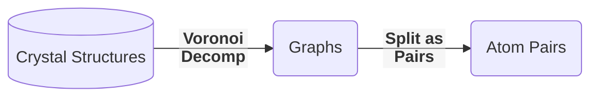
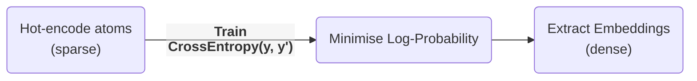

# Learning embeddings for atoms

These are some of my opinions and ideas after reading [Distributed representations of atoms and materials for
machine learning][Nature] (2022).

-----------

## Summary

The paper proposes SkipAtom, an unsupervised-learning approach to learn atom-embeddings.

Compound embeddings can be created by combining atom-emdeddings, then used for property prediction neural networks (NNs) and other tasks.

## Skip-gram, SkipAtom

Skip-gram is an NLP algorithm to generate word embeddings.

In Skip-gram, hot-encoded words are projected onto a dense, lower-dimensional vector, which is then decoded into another word.

In SkipAtom, hot-encoded atoms are projected instead, and the task is to predict its neighbours' hot-encoded vectors with the least error.

## High-Level procedure

The process followed is first retrieve compounds and generate atom-pair-datasets:

And next train two projection layers:

* Embeddings from similar environments result in close vectors (e.g. $\mathrm{C}$, $\mathrm{N}$, $\mathrm{O}$,..).
* The representation is now dense and the vector space is ordered/semantic.
* The architecture is described as:
    > (...) single hidden layer with linear activation, whose size depended on the desired dimensionality of the learned embeddings, and an output layer with 86 neurons (one for each of the utilized atom types) with softmax activation. (...) minimizing the cross-entropy loss between the predicted context atom probabilities and the one-hot vector representing the context atom, given the one-vector representing the target atom as input. Training utilized stochastic gradient descent with the Adam optimizer, with a learning rate of $10^{−2}$ and a mini-batch size of 1024, for
    ten epochs.

## Distributed Representations

In this context, distributed representations are just vectors for atoms. They can be continuous or discrete, sparse or dense.[^1]

Which ways are there to create vector-representations of atoms?

| Random | One-Hot | Atom2Vec | Mat2Vec | SkipAtom|
|--------|---------|----------|---------|----------|
| From Random Distributions  | One 1, rest 0s | SVD of Co-Occurence Matrix      | Embedding (Word2Vec)| Embedding (Skip-gram) |
| $(0.4,\ldots,0.6)$ | $(0,\ldots,1,\ldots,0)$|- | - | -|
|dense|sparse|sparse|dense|dense|

**Comments**

* Atom2Vec: any matrix (square or not) has SVD; but does this improves over co-occurences vector?
* Mat2Vec: The projection matrix, initially random, ends up storing embeddings.
    * Task: context-words predict centre-word. Example: `The cat ___ on the mat.`
* SkipAtom: In the same paper of Word2Vec there is the Skip-gram algorithm, which is adapted for chemistry in this paper.
    * Task: centre-word predicts context-words. Example: `___ ___ sat __ ___ ____` (same sentence).

### Embeddings

Embeddings are vectors in real ($R^n$) non-random vector-space, representing an object. _Real_ here implies continuous.

Not all vector or distributed representations are embeddings.

For embeddings, similar objects have similar vectors, according to some metric.

### Combining Vectors (pooling)

The analogy to NLP is that _words are like atoms_, and _sentences are like compounds_. Hence, distributed representations for atoms can be combined (pooled) into a vector representing a compound.

Vector-pooling options are:
* _sum_: $\sum s_i \vec{a}_i$ where $s_i$ is the stoichiometry (can be fractional),
* _mean_: $\frac{\sum s_i \vec{a}_i}{\sum s_i}$, i.e. divided by total number of atoms (can be fractional too).
* _max_: $\mathrm{max}(M_i)$, reduces material matrix $\mathrm{M}$ to vector. Selects max value of each column, each row being an atom in the compound.

The resulting compound representation is then used for training a feed-forward NN on different tasks. Also benchmarked using MatBench.

The pooling can also be done with hot-encoded vectors. This is done in ElemNet (mean pooling), and in Bag-of-atoms (sum pooling). In these cases, the result is a sparse vector.

## Pros and Cons

On the on hand, similar compounds will have similar vectors, which is useful; on the other hand, all isomers have the same vector, which is a limitation of what this method can express.

The embeddings do not include structural information, oxidation state and so forth. Though it can be easily extended.

This approach is attractive because the training does not rely on labelled data (unsupervised learning).

The model just needs the formula at inference time, and does fine with non-stoichiometric solids. In other words, having just the material's composition &mdash;but no structural information&mdash; we can still calculate some properties.

[Nature]: https://www.nature.com/articles/s41524-022-00729-3
[^1]: This are just my definitions and may be wrong!
