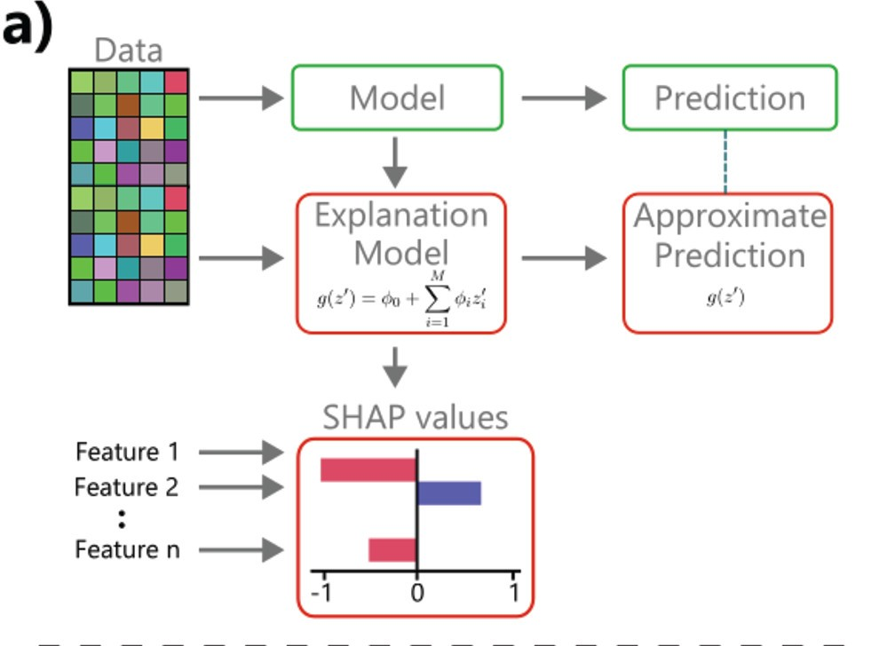
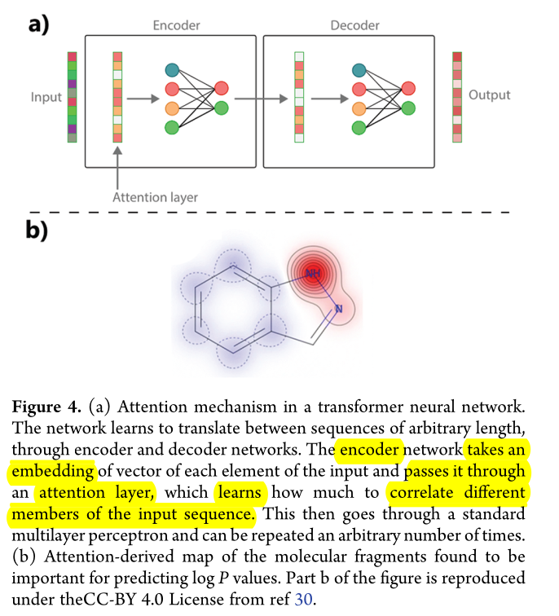

# Explainable AI for chemistry

These are some of my opinions and ideas after reading [Interpretable and Explainable Machine Learning for Materials Science and Chemistry][Account] (2022).

--------------------

## Summary

Survey of methods that can help to make classical ML and DL algorithms more interpretable, that is, easier to understand for a human.

## Introduction

Scientist strive to explain the world. When a mathematical description or model is proposed, it is expected to be interpretable. By _interpretable_ we mean understood by a human, both mathematically and conceptually.

A conceptual level generally means that we explain it using terms from the domain of applicability of the model. Here are two examples:

* In chemistry, this could be electronegativity or mass.
* In physics, if we take a Hamiltonian, we can talk about the kinetic energy term, the electric potential term, and so on. We can also understand its mathematical structure as part of a differential equation.

## The question

ML algorithms tend to be interpretable in a general sense (a human can explain it); however, deep neural networks (DNNs) are often considered black boxes.

But insofar as we are doing _science_ with deep learning models, it is important to understand the model itself, not just its output.

This is how we get to the question to be explored:

* How can scientists gain deeper understanding of traditional ML algorithms and DNNs?

(Admittedly, in some cases we may be satisfied with DNNs' predictive power alone.)

## Concepts

The paper defines a few concepts, I use my own terms below.

* _Correctness_: how accurate the model is.
* _Domainness_: extent to which the mathematical model is explained by domain concepts e.g. mass or charge.
    * If high: helps experts build confidence interpreting the outputs.

There is usually a tradeoff between _domainness_ and _correctness_ because complex behaviour requires complex networks or models, to which we can rarely assign high domainness.

They mention, as an example of high domainness, the compatibility of a DNN with the Penn model of dielectrics (possibly some of its inner working cleanly maps to the Penn model).

Both for DNNs and classical ML algorithms _intrinsic_ and _extrinsic_ methods are detailed. These refer to methods or techniques to make the model more interpretable.

Intrinsic and extrinsic methods are complementary.

## Interpreting Classical ML Algorithms

As an example of Classical ML think of Support Vector Regression, and other kinds of regressions.

### Intrinsic methods

We want to make the mathematical model more interpretable. Regardless of our knowledge, some models will map in a more meaningful manner to the phenomenon being modelled.

These are methods that can help us with it:

* Simplifying the model (when possible)
    * Regularisation Approaches (SISSO, LASSO) can help by identifying the most important descriptors to use.
    * LASSO: to remove features when tightly correlated (leaving the most helpful one).
* Generalised Linear Models (GLMs) where the generalised model approximates the more complex model i.e $g(z) \approx f(z)$, respectively. The GLM, $g(z)$, is defined as:
    $$g(z) = \psi_0 + \sum_{i=1}^M \psi_i z_i$$

### Extrinsic Methods

We want to understand the model by looking at it's behaviour. Its outputs, input-outputs relationships, and so on.

* What-if: Correlate changes in input-features with changes in outputs.
    * Partial Dependence Plots (PDPs). Though it masks possible correlations between features (if all are kept constant but one).
    * Individual Conditional Expectations (ICE) overcomes the limitation above.
    * Feature Importance methods: partial derivative of an output w.r.t some input feature.[^1]
    * Shapley Analysis: involves fitting a linear model using nearby input-points.
        * We get insight on which features are locally relevant, by looking at the accompanying coefficients.
        * The coefficients quantify the effect of each feature in the output.
        * It seems to be derived from the GLM. (I assume they fit different GLMs to different areas of their input space, and then analyze the distribution of coefficients? I am unsure.)
    * Counterfactual Analysis: I did not follow this one, so I skip it. However, counterfactuals are hypotheticals like: X wouldn't have happened hadn't Y not happened.

The image below is from the paper, under [CC BY 4.0] (cropped), the main things to notice are the linear generalised model and the Shapley's contributions from different features (how much each feature affects the output). It seems to derive from the GLM.

 <!--other classes: w220, w420-->
    
    

    Image from <a href="https://pubs.acs.org/doi/10.1021/accountsmr.1c00244">Original Paper</a> under <a href="https://creativecommons.org/licenses/by/4.0/">CC-BY-SA 4.0</a>
    

## Interpreting Deep Learning Models

This is the interesting part at present (2026), although the paper attention is split between deep learning and classical machine learning, so there isn't very much about deep learning.

The paper mentions the _processing_ and _representation_ approaches. These concepts map to "what ifs" (or extrinsic)  and "looking inside the model" (intrinsic).

### Extrinsic Methods

* Processing Methods: How the model processes an input (like what-if analyses i.e extrinsic).
    * Salience Methods or Class Activation Maps: Finding which filters are most sensitive to which features or image regions.
        * For example, we decompose sum for a class prediction, and find where the largest contribution came from. That way we can tell which filter may be most responsible for a particular feature in an image.
        * analyse which activations respond stronger to which features (e.g class activation map or CAM)
        * or where changes in the activations change the output the most (derivatives/gradients, grad-CAM).
    * Attention-based approches: this is very similar to salience methods. I expand below.

The paper mentions transformers as well. A transformer operates upon an embedding, for example an atom vector, and learns which parts pay attention to other parts. These are called _attention masks_.

A good explanation is provided as an image (highlights are mine):

 <!--other classes: w220, w420-->
    
    

    Image from <a href="https://pubs.acs.org/doi/10.1021/accountsmr.1c00244">Original Paper</a> under <a href="https://creativecommons.org/licenses/by/4.0/">CC-BY-SA 4.0</a>
    

The paper continues (bold is mine):

> These representations, known as _attention masks_, can be **interpreted in similar way to salience maps and determine sections of the input data that a model exploits for making predictions**. The authors of a transformer model trained on chemical reaction data were able to perform atom-mapping and learn chemical grammars, i.e., identify atoms during a chemical reaction, by interpreting its learned attention map.

Finally the paper warns us:

> With salience and attention-based approaches, there is a danger of overinterpretation, particularly in cases where physical explanations are searched for.

It's mentioned as well, that it's important to test any physical interpretation with more than one class (of molecule, image, or input), since two errors can happen:

* What is observed happens for all classes.
* What is observer is just the network exploiting some correlation, without real meaning (_shortcut learning_).

Both $\beta$-VAEs or transformers are considered quite explainable models.

### Intrinsic Methods
There isn't much about these ones, this is what I take away:

* Representation Methods: Interpret the learnt representations (i.e intrinsic). This is not always possible and sometimes may be just somewhat interpretable, or interpretable "to a degree".
* Introducing inductive biases related to symmetry.

[Account]: https://pubs.acs.org/doi/10.1021/accountsmr.1c00244
[CC BY 4.0]: https://creativecommons.org/licenses/by/4.0/
[^1]:  This I think can be done also numerically, without actually calculating the derivative. See refs 20 and 21 in the paper for more detail.
