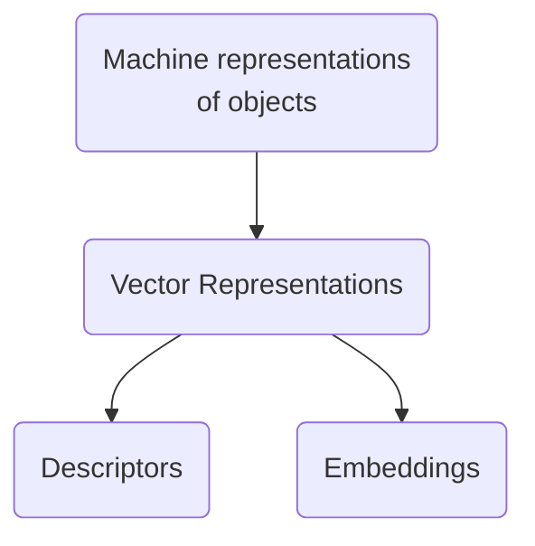

# Atom vectors

<!-- In the [Future of AI Technology] (1992), Marvin Minsky said: -->
<!---->
<!-- > First we'll have to change some present-day ideas. For example, many students like to ask, "Is it better to represent knowledge with Neural Nets, Logical Deduction, Semantic Networks, Frames, Scripts, Rule-Based Systems or Natural Language?" My teaching method is to try to get them to ask a different kind of question. "First decide what kinds of reasoning might be best for each different kind of problem -- and then find out which combination of representations might work well in each case." -->

<!-- In [Scientific discovery in the age of artificial intelligence][dl_science] (2023), Yoshua Bengio, Max Welling et.al., write (references removed): -->
<!---->
<!-- > Scientifically meaningful representations are compact, discriminative, disentangle underlying factors of variation and encode underlying mechanisms that generalize across numerous tasks. -->
<!---->
<!-- And then go on to suggest ways to achieve this. -->
<!---->
The quest for _machine representations of objects_ is a long-standing research theme. For example, we have vector representations:



_Descriptors_ are expert-designed vectors; _embeddings_ are machine-learnt vectors $\in \mathbb{R}^N$.

This post focuses on _embeddings_ because they require less human effort, and produce more general-purpose vectors.

## Characteristics of Embeddings

_Embeddings_ are usually real-valued, dense rather than sparse, non-human readable. They also form a structured vector-space, with semantically similar vectors close together, and meaningful vector-arithmetic.

It is desirable, but not always possible that they:

- Are interpretable,
- Can be generated with data scarce environments,
    - Or are data-hungry but it is easily available,

The paper [Scientific discovery in the age of artificial intelligence][dl_science] proposes a different list of characteristics (references removed):

> Scientifically meaningful representations are compact, discriminative, disentangle underlying factors of variation and encode underlying mechanisms that generalize across numerous tasks.

Though here _representation_ doesn't necessarily refer to generated embeddings (my reading of it, at least), but both to generated embeddings and ways to encode and represent the input.

They suggest that promising approaches to achieve this task are: `1.` Geometric deep learning, `2.` Self-supervised learning (pre-trained on unlabelled data, then fine-tuned), `3.` Language modelling, here they proposed traditional next-token learning, and also masked learning; and the language part refers to learning sequences be it language or molecular strings etc.

## Embeddings for Atoms

Embeddings for atoms were inspired by NLP models from the 2010s.

One such example was learning [continuous vector representations of words][word embeddings] (2013). They proposed an automated mechanism to generate word-vectors by absorbing information from that word's environment (neighbouring words).

In chemistry, embeddings can be used for downstream machine-learning tasks such as materials' property prediction, so they became popular in the field. Materials science has exploited the same ideas, for example:

- <q>properties of an atom can be inferred from the environments it lives in</q> ([Atom2Vec], 2018),
- <q>atoms are to compounds as words are to sentences</q> ([SkipAtom], 2022),

The surprise was that similar words (or atoms) end up with similar vectors. The vectors also support semantically meaningful arithmetic operations, and became useful for downstream tasks. A classic example was:

```txt
vector("Queen") = vector("King") - vector("Man") + vector("Woman")
```

Both [Atom2Vec] (2018) and [SkipAtom] (2022) are unsupervised algorithms that obtain their atom vectors from databases of compounds. Atom vectors can be combined into compound vectors, and used for downstream tasks like property-prediction.

### Classifications and Featurisers

The method used to generate our vectors is called a _featuriser_ (we can use a featuriser or create our own). There are many common approaches:

- Simple: like hot-encoded, random;
- Human-designed: Composition-Based Feature Vector (CBFV) which are expert-curated vectors as in Jarvis, Magpie;
- Machine-learnt: embeddings, like SkipAtom.

Atom-vectors can be combined to describe compounds. Examples of combination methods are concatenation into a long vector and pooling of vectors (e.g. summing them up).

### Comparing representations

A performance-comparison of vector representations is carried out in ["Is domain knowledge necessary for machine learning materials properties?"][comparison] (2020).

Their conclusion is: human-designed Composition Based Feature Vectors (CBFV like Jarvis and Olyinyk) outperform other methods if there isn't much data. This was prior to SkipAtom, but does include Atom2Vec.

Otherwise, performance in downstream tasks is similar to hot-encoded or random vectors.

> (...) Although new, data-driven approaches are of interest, those studied here have yet to surpass CBFVs in terms of material property prediction with small data.

However, ["Domain Independent XAI for Material Science"][ehme] (2025) challenges that conclusion:

> Our method challenges this perception: we obtain excellent classifiers that are interpretable and based on a small amount of training data without using any domain knowledge: (...)

They assert that one-hot encoded vectors can still achieve good results using small datasets, as long as the network is designed in the way they specify.

## Thoughts

Human-designed vectors are easier to interpret; machine-learnt vectors require less effort but more data to train them.

Can we design machine-learnt interpretable vectors that are intrinsically interpretable? Attention-masks and disentangled representations are closer to this.

Should the representation be just the simplest, and the network learn all that is needed for the given tasks?

[dl_science]: https://www.nature.com/articles/s41586-023-06221-2
[SkipAtom]: https://www.nature.com/articles/s41524-022-00729-3
[Atom2Vec]: https://pnas.org/doi/full/10.1073/pnas.1801181115
[word embeddings]: https://arxiv.org/abs/1301.3781v3
[comparison]: https://www.researchgate.net/profile/Taylor-Sparks-2/publication/343926838_Is_Domain_Knowledge_Necessary_for_Machine_Learning_Materials_Properties
[ehme]: https://www.fruct.org/files/publications/volume-38/fruct38/Urs.pdf
