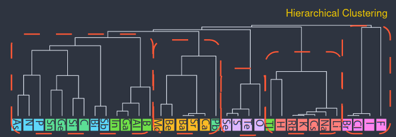

# Atom Vectors - Key Ideas

These are some of my opinions and ideas after reading the "[Atom2Vec][PNAS]" (2018) and "[SkipAtom][Nature]" (2022) papers.

-----------

## Background: Vectors in NLP

Around 2014, Mikolov et. al. proposed an algorithm for machine-learning vector representations of words.

The insight was to encode information about the word's environment (neighbouring words). The vector space had similar word clustered together, and these vectors became useful for downstream tasks.

By exploiting the analogy that _words are to sentences what to atoms are to compounds_, computational chemists have built upon these findings.

## Vectors in Chemistry

Atom vectors can be _built_ from empirical features or they can be _learnt_ by an algorithm[^1]. Learning vectors yields more general-purpose vectors, and has won in popularity.

Both _Atom2Vec_ and _SkipAtom_ are unsupervised algorithms that obtain their atom vectors from compound-databases. Atom vectors can be combined into compound vectors, and used for downstream tasks like property-prediction.

These approaches compete with others that use crystal-structure information, but are computationally cheaper.

## Summary of approaches

Distributed representations are the technical name for the vectors (for atoms, compounds, words,..) we have talked about. They can be continuous or discrete, sparse or dense.[^2]

Which ways are there to create vector-representations of atoms?

| Random | One-Hot | Atom2Vec | Mat2Vec | SkipAtom|
|--------|---------|----------|---------|----------|
| From Random Distributions  | One 1, rest 0s | SVD of Atom-Group matrix  | Embedding (Word2Vec)| Embedding (Skip-gram) |
| $(0.4,\ldots,0.6)$ | $(0,\ldots,1,\ldots,0)$| as random | as random | as random |
|dense|sparse|sparse|dense|dense|

## Comments

- **Atom2Vec**: Discussed below.
- **SkipAtom**: Discussed in next post.
- **Mat2Vec**: The projection matrix, initially random, ends up storing embeddings.
    - Task: context-words predict centre-word. Example: `The cat ___ on the mat.`

Let's see how each algorithm obtains the atom vectors.

### Atom2Vec

Atom2Vec uses defines a matrix ($X$) where each column is an environment and each row an element. Each $X_{ij}$ can be 0 or a natural number, and represents the _count_ of those atom-environment combinations. In other words, $X$ is a co-occurence matrix of atom-environment pairs.

|  |(2)Sb3|(2)Se3|(2)Te3|(3)Bi2|(3)Sb2|(3)O2|(3)S2|
| ----          | ---- | -----|------|------|------|-----|-----|
| Bi| 1 | 1 |1|0|0|1 | 0 |
| Sb | 0 | 1 |1|1|0|0 | 1 |
| ... | 0 | 0 |8|0|0|4 | 3 |

The index `(N)` is the stoichiometry of the atom in the compound $\mathrm{Bi_2Sb_3}$ for the first column. Each atom-vector is sparse, since a particular atom binds to a small fraction of all groups.

A normalised matrix $X_u$ is obtain by independently normalising each row vector. Using euclidean norm (2-norm) allows for an intuitive similarity metric:

$$\mathrm{dist}(\vec{u_1},\vec{u_2}) = 1 - \vec{u_1} \cdot \vec{u_2} = 1 - \mathrm{similarity}$$

In their best-performing model, they compute $SVD(X_u) = U\,D\,V^T$, collect the $d$-rows with the largest singular values, and compute $F = U'\,D'$ where $D'$ is the slice of rows of D with the $d$ largest singular values, and $U'$ the corresponding columns.

> [!NOTE]
> The strategy has certain beauty to it: the new f-vectors retain the inner product similarity but are denser. Though now, the columns have no explicit meaning.

They find:

- Similar atoms have similar vectors,
- Increasing the distance threshold _in stages_, vectors can be clustered hierarchically, from the leaf-nodes (atoms) downwards (groups).
    - At some level, groups match the periodic table groups. (I don't know how the grouping is made unambiguous).
    - At a very large distance, all atoms merge into a single group. The result is called _dendogram_.

    
    

    Image (modified) from <a href="https://pnas.org/doi/full/10.1073/pnas.1801181115">Original Paper</a> under <a href="https://creativecommons.org/licenses/by/4.0/">CC-BY-SA 4.0</a>. The atoms are rotated to make the image fit (rotated).
    

- Looking at the variation of some dimensions in the vectors, we can assign meaning to some of them.

Then, they compared to "empirical features" &mdash; a vector `(group, period,...)`, randomly padded to match their $d$&mdash;, with the task of predicting the DFT-found formation-energies of $\approx 10^4$ elpasolite crystals ($\mathrm{ABC_2D_6}$). They represent each solid as a concatenation of atom vectors, and feed it to a hidden layer. (They also do other tasks.)

The paper ends with an interesting insight:

> Structural information has to be taken into account to accurately model how atoms are bound together to form either environment or compound, where the recent development on recursive and graph-based neural networks might help.

[Nature]: https://www.nature.com/articles/s41524-022-00729-3
[PNAS]: https://pnas.org/doi/full/10.1073/pnas.1801181115

[^1]: Empirical features refers to the group and period (and potentially charge, mass, ..). This was widely used prior to 2018, before the automated ones.

[^2]: This are just my definitions and may be wrong!
