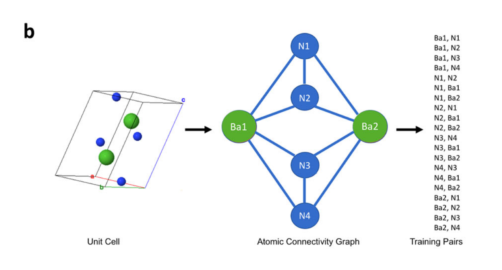
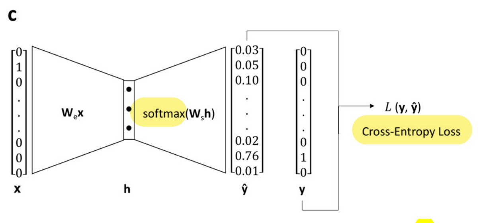

# Vectors for atoms

These are some of my opinions and ideas after reading the [Atom2Vec][PNAS] (2018) and [SkipAtom][Nature] (2022) papers.

-----------

## Introduction

We want to represent atoms in a machine-useful way. One way is to _represent atoms as vectors_. Both Atom2Vec and SkipAtom are unsupervised algorithms to generate these vectors.

Atom vectors can be combined into compound vectors, and these used for downstream tasks like property-prediction.

These approaches are competitive with others that use structural information, but are computationally cheaper.

## Atom2Vec

Involves collecting all groups each atom in the periodic table is linked to, and this makes up the vector (it is slightly more subtle than this, but it's the gist).

Each atom-vector is very sparse, since a particular atom binds to a small fraction of all groups. Similar atoms have similar vectors.

They use two algorithms to extract information from the matrix:

1. "Model-free machine" uses SVD and selects the vectors with the $d$ row vectors with the largest singular values. $d$ must be the number of groups, but I'm unsure. This model performed best.
2. "Model-based machine" uses random vectors and optimises them (does not explain much).

### Findings

- Comparing the resulting vectors &mdash;just by looking at them&mdash; it's clear similar atoms are clustered nearby in the high-dimensional vector space.
- It's also possible by looking at the variation of some dimensions, to assign meaning to some of them.
- Measuring similarity they end up grouped as in the periodic table. Also projecting first and second dimensions show clustering.

## SkipAtom

First, compounds are downloaded, then the atom-pairs-dataset is generated. The Voronoi Decomposition helps derive training-pairs from the unit cell. This is shown in the image below:

    
    

    Image from <a href="https://www.nature.com/articles/s41524-022-00729-3">Original Paper</a> under <a href="https://creativecommons.org/licenses/by/4.0/">CC-BY-SA 4.0</a>
    

Next, use the dataset for training a shallow network, trained to predict the neighbour-pair. Visually, it looks like this:

    
    

    Image from <a href="https://www.nature.com/articles/s41524-022-00729-3">Original Paper</a> (slightly modified) under <a href="https://creativecommons.org/licenses/by/4.0/">CC-BY-SA 4.0</a>
    

- The resulting representation is dense and structured/semantic. This can be shown using dimensionality reduction techniques (PCA, t-SNE,..)
- The architecture is described as:
    > (...) single hidden layer with linear activation, whose size depended on the desired dimensionality of the learned embeddings, and an output layer with 86 neurons (one for each of the utilized atom types) with softmax activation. (...) minimizing the cross-entropy loss between the predicted context atom probabilities and the one-hot vector representing the context atom, given the one-vector representing the target atom as input.

## Distributed Representations of Atoms

In this context, distributed representations are just vectors for atoms or compounds. They can be continuous or discrete, sparse or dense.[^1]

Which ways are there to create vector-representations of atoms?

| Random | One-Hot | Atom2Vec | Mat2Vec | SkipAtom|
|--------|---------|----------|---------|----------|
| From Random Distributions  | One 1, rest 0s | SVD of Co-Occurence Matrix      | Embedding (Word2Vec)| Embedding (Skip-gram) |
| $(0.4,\ldots,0.6)$ | $(0,\ldots,1,\ldots,0)$| as random | as random | as random |
|dense|sparse|sparse|dense|dense|

### Comments

- **Atom2Vec**: any matrix (square or not) has SVD; but does this improves over co-occurences vector?
- **Mat2Vec**: The projection matrix, initially random, ends up storing embeddings.
    - Task: context-words predict centre-word. Example: `The cat ___ on the mat.`
- **SkipAtom**: In the same paper of Word2Vec there is the Skip-gram algorithm, which is adapted for chemistry in this paper.
    - Task: centre-word predicts context-words. Example: `___ ___ sat __ ___ ____` (same sentence).

### Embeddings

Embeddings are vectors in real ($R^n$) non-random vector-space, representing an object. _Real_ here implies continuous.

Not all vector or distributed representations are embeddings.

For embeddings, similar objects have similar vectors, according to some metric.

### Representations of Compounds (Pooling)

The analogy to NLP is that _words are like atoms_, and _sentences are like compounds_. Hence, distributed representations of atoms can be combined (pooled) into a vector representing a compound.

Vector-pooling options are:

- _sum_: $\sum s_i \vec{a}_i$ where $s_i$ is the stoichiometry (can be fractional),
- _mean_: $\frac{\sum s_i \vec{a}_i}{\sum s_i}$, i.e. divided by total number of atoms (can be fractional too).
- _max_: $\mathrm{max}(M_i)$, reduces material matrix $\mathrm{M}$ to vector. Selects max value of each column, each row being an atom in the compound.

The resulting compound representation is then used for training a feed-forward NN on different tasks. Also benchmarked using MatBench.

The pooling can also be done with hot-encoded vectors. This is done in ElemNet (mean pooling), and in Bag-of-atoms (sum pooling). In these cases, the result is a _sparse_ vector.

[Nature]: https://www.nature.com/articles/s41524-022-00729-3
[PNAS]: https://pnas.org/doi/full/10.1073/pnas.1801181115
[^1]: This are just my definitions and may be wrong!
